<!-- Copy and paste the converted output. -->

>>>>>  gd2md-html alert:  ERRORs: 4; WARNINGs: 2; ALERTS: 50.

<ul style="color: red; font-weight: bold"><li>See top comment block for details on ERRORs and WARNINGs. <li>In the converted Markdown or HTML, search for inline alerts that start with >>>>>  gd2md-html alert:  for specific instances that need correction.</ul>

Links to alert messages:
<a href="#gdcalert1">alert1</a>
<a href="#gdcalert2">alert2</a>
<a href="#gdcalert3">alert3</a>
<a href="#gdcalert4">alert4</a>
<a href="#gdcalert5">alert5</a>
<a href="#gdcalert6">alert6</a>
<a href="#gdcalert7">alert7</a>
<a href="#gdcalert8">alert8</a>
<a href="#gdcalert9">alert9</a>
<a href="#gdcalert10">alert10</a>
<a href="#gdcalert11">alert11</a>
<a href="#gdcalert12">alert12</a>
<a href="#gdcalert13">alert13</a>
<a href="#gdcalert14">alert14</a>
<a href="#gdcalert15">alert15</a>
<a href="#gdcalert16">alert16</a>
<a href="#gdcalert17">alert17</a>
<a href="#gdcalert18">alert18</a>
<a href="#gdcalert19">alert19</a>
<a href="#gdcalert20">alert20</a>
<a href="#gdcalert21">alert21</a>
<a href="#gdcalert22">alert22</a>
<a href="#gdcalert23">alert23</a>
<a href="#gdcalert24">alert24</a>
<a href="#gdcalert25">alert25</a>
<a href="#gdcalert26">alert26</a>
<a href="#gdcalert27">alert27</a>
<a href="#gdcalert28">alert28</a>
<a href="#gdcalert29">alert29</a>
<a href="#gdcalert30">alert30</a>
<a href="#gdcalert31">alert31</a>
<a href="#gdcalert32">alert32</a>
<a href="#gdcalert33">alert33</a>
<a href="#gdcalert34">alert34</a>
<a href="#gdcalert35">alert35</a>
<a href="#gdcalert36">alert36</a>
<a href="#gdcalert37">alert37</a>
<a href="#gdcalert38">alert38</a>
<a href="#gdcalert39">alert39</a>
<a href="#gdcalert40">alert40</a>
<a href="#gdcalert41">alert41</a>
<a href="#gdcalert42">alert42</a>
<a href="#gdcalert43">alert43</a>
<a href="#gdcalert44">alert44</a>
<a href="#gdcalert45">alert45</a>
<a href="#gdcalert46">alert46</a>
<a href="#gdcalert47">alert47</a>
<a href="#gdcalert48">alert48</a>
<a href="#gdcalert49">alert49</a>
<a href="#gdcalert50">alert50</a>

>>>>> PLEASE check and correct alert issues and delete this message and the inline alerts.

# 

>>>>>  gd2md-html alert: inline image link here (to images/image1.png). Store image on your image server and adjust path/filename/extension if necessary.  (<a href="#">Back to top</a>)(<a href="#gdcalert2">Next alert</a>) >>>>> 

# **HDM 2.1 for VMware Cloud Director**

# **Install Guide**

 	            

Version: 2.1

Publish Date: August, 2020

Copyright © 2020 PrimaryIO, Inc.

PrimaryIO, Inc.

300 3rd St.

Los Altos, CA 94022

[http://www.primaryio.com](http://www.primaryio.com)

**Tel:** 877-817-7790

Copyright Notice

Copyright © 2020 PrimaryIO, Inc. 

This document is provided for informational purposes only and PrimaryIO makes no warranties, either expressed or implied in this document. 

Information in this document, including URL and other Internet references, is subject to change without notice. The entire risk of the use or the results from the use of this document remains with the user. 

Unless otherwise noted, the companies, organizations, products, domain names, e-mail addresses, logos, people, places, and events depicted in examples herein are fictitious. 

No association with any real company, organization, product, domain name, e-mail address, logo, person, place, or event is intended or should be inferred. 

Complying with all applicable copyright laws is the responsibility of the user. Without limiting the rights under copyright, no part of this document may be reproduced, stored in or introduced into a retrieval system, or transmitted in any form or by any means (electronic, mechanical, photocopying, recording, or otherwise), or for any purpose, without the written permission of PrimaryIO. 

PrimaryIO may have patents, patent applications, trademarks, copyrights, or other intellectual property rights covering subject matter in this document. Except as explicitly provided in any written license agreement from PrimaryIO, the furnishing of this document does not guarantee any license to these patents, trademarks, copyrights, or other intellectual property. 

© 2012 - 2020 PrimaryIO. 

All rights reserved. 

Trademarks

PrimaryIO HDM™ is a registered trademark of PrimaryIO, Inc in the United States and/or other jurisdictions. 

VMware is a registered trademark of VMware, Inc. in the United States and/or other jurisdictions.

All other trademarks referred to in this guide are owned by their respective companies.

Contents

[TOC]

## 

# About the HDM Install Guide

The HDM install guide describes how to deploy, configure, and undeploy PrimaryIO Hybrid Data Management (HDM) 2.1 for enabling migrations of virtual machines to VMware Cloud Director (vCD).

## Intended Audience

This document is intended for administrators looking for a virtual machine migration solution to VMware Cloud Director. HDM is designed to address faster migrations to the cloud with minimal data transfer.

## **HDM 2.1 Software Package**

HDM is delivered as a virtual/software solution; when HDM software is installed, it consists of a single virtual appliance. Further deployment of HDM 2.1 components then occur on-premises in VMware vCenter and in the cloud on vCD.

The HDM 2.1 package can be downloaded from [http://release.primaryio.com/vmware/HDM_2.1/](http://release.primaryio.com/vmware/HDM_2.1/2.1.2077/)

The package includes the following components:

1. HDM_2.1 zip (contains the HDM appliance as an Open Virtual Format (OVF) file)
2. vCD (contains documents for deploying and managing HDM 2.1 on vCD)
    1. HDM 2.1 Install Guide - vCD.pdf
    2. HDM 2.1 Admin Guide - vCD.pdf
    3. HDM 2.1 Troubleshooting Guide - vCD.pdf
    4. HDM 2.1 Release Notes - vCD.pdf
    5. [HDM 2.1 Quick Start Guide - vCD.pdf](http://release.primaryio.com/vmware/HDM_2.1/2.1.2077/VCD/HDM%202.1%20Quick%20Start%20Guide%20-%20VCD.pdf)
    6. HDM 2.1 Deployment Checklist - vCD.pdf

## HDM Components

HDM consists of the following components that are dispersed between cloud and on-premises data centers (figure 1). These components are microservices packaged as VMs that work together to provide the data and control path necessary for its use cases. They also provide a flexible deployment model and failure resilience.

HDM 2.1 consists of microservices that have been packaged as VMs that work together to provide the data and control path to support the aforementioned use cases and to provide a flexible deployment model and failure resilience. HDM comprises the following components, dispersed between cloud and on-premises data centers (figure 1): 

1. **PrimaryIO Plug-in: **Installed and registered on VMware vCenter for HDM management.
2. **PrimaryIO Manager:** The main controlling appliance that controls and orchestrates the entire system.
3. **On-premises Storage Gateway:** Provides access across the WAN link to deliver traffic optimization and redundancy against failures. It also accesses and manages the on-premises VMDKs for cloud-based VMs.
4. **Cloud Storage Gateway: **Provides access across the WAN link to enable cloud-based VMs read/write access back to the on-premises environment. It is possible to have multiple gateways for redundancy.
5. **Sync Daemon:** Located in both environments to deliver compression, encryption, and de-duplication for data being transferred from on-premises to cloud environments. It also provides a mechanism to pause and resume data transfers in the event of a WAN disconnect.

_Figure 1: Location of HDM 2.1 components_

>>>>>  gd2md-html alert: inline image link here (to images/image2.png). Store image on your image server and adjust path/filename/extension if necessary.  (<a href="#">Back to top</a>)(<a href="#gdcalert3">Next alert</a>) >>>>> 

# 

# HDM Deployment

## Deployment Requirements

HDM provides a flexible deployment model to support a wide range of user needs regarding use case, performance, scalability, and security. This section will help you choose the correct deployment type and network topology to support your needs. 

### Deployment Types 

#### Ultra-Lite, Lite, Standard, or Performance

HDM provides _ultra-lite_, _lite_, _standard_, and _performance_ deployment options. The trade-off between them is CPU and memory resource utilization, versus the concurrent migration capacity. Here are a few points to keep in mind when choosing the option that best fits your needs:

1. Ultra-lite is the least resource intensive of the options. However, it only supports cold migration, and only to vCD.
2. The lite option requires the least number of resources to support all HDM migration use cases. However, it is limited in migration parallelism and number of concurrently migrated VMs, compared to standard and performance deployment options.
3. The standard option is more scalable but requires more resources than the lite option, but is less scalable and requires fewer resources than the performance option.
4. The performance option requires the highest number of resources, but it provides the highest migration parallelism and number of concurrently migrated VMs.

More details on the resource requirements for these deployment options is available in the next section.**_ _**

**NOTE:_ _**Ultra-lite is the only Resource Allocation that supports migration to vCD.

#### Standalone or Cluster

You can choose either a standalone or cluster deployment mode, based on your scale and fault tolerance requirements. Here are a few points to keep in mind:

1. In standalone mode, a fixed number of HDM components are installed, regardless of the size of the on-premises cluster. Also, there is no HDM component redundancy in this mode, so fault tolerance is low.
2. In cluster mode, some HDM components are installed in proportion to the scale of the on-premises cluster to deliver higher redundancy and better fault tolerance. This requires higher resource consumption, but allows a higher number of concurrent migrations, than the standalone option.

### Concurrency and Scale Support 

HDM queues all migrations requests and is capable of processing eight VMDKs per HDM cluster node. 

	

### HDM Resource Requirements

Table 1 lists the resource requirements for each deployment type.

_Table 1: Resource Requirements_

<table>
  <tr>
   <td><em> </em>
   </td>
   <td><strong>Standalone</strong>
   </td>
   <td><strong>Cluster (N)</strong>
   </td>
  </tr>
  <tr>
   <td><strong>Ultra-Lite</strong>
   </td>
   <td>
   </td>
   <td><em>NA</em>
   </td>
  </tr>
  <tr>
   <td>On-premises
   </td>
   <td><strong>1</strong> Appliance (4 vCPU, 8 GB RAM, 144 GB disk)

<strong>1</strong> ESXMgr (4 vCPU, 4 GB RAM, 128 GB disk)
   </td>
   <td>1 Appliance (4 vCPU, 8 GB RAM, 144 GB disk)

2 ESXMgr (4 vCPU, 4 GB RAM, 128 GB disk)
   </td>
  </tr>
  <tr>
   <td>Cloud
   </td>
   <td><strong>1</strong> CloudCache (6 vCPU, 5 GB RAM, 64 GB disk)
   </td>
   <td>2 CloudCache (6 vCPU, 5 GB RAM, 64 GB disk)
   </td>
  </tr>
</table>

**NOTES**: 

1. The names _ESXMgr_ and _CloudCache_ are abbreviated names for the VMs containing HDM components. These are created as part of the HDM deployment.
2. The N in _Cluster (N)_ refers to the number of nodes in the cloud cluster.

### **Network Topology **

Your network topology choices determine how the HDM components will be configured within your network. It also dictates how VMs will be migrated to best support post-migration network security and VM isolation requirements. 

HDM provides the following network configuration flexibility:

1. Choice of networks HDM components should use
2. Choice of IP allocation type for HDM components

#### **Network Types**

An ideal network configuration isolates various types of network traffic for maximum security, performance, and access control. HDM assumes the following types of networks can be present in the environment:

1. Management Network (VM Network): This network usually maps to the VM network and provides access to vCenter. All management API communications with vCenter take place over this network.
2. ESXi Network (ESXi_Network): This network usually maps to the VM network and provides access to ESXi.
3. HDM Internal Network (HDM_Internal_Network): This network is used by HDM for communication among its components. It is recommended to configure a dedicated low latency network for this purpose. This network is illustrated in figure 2 as _PrimaryIO On-Premises_ and _PrimaryIO Cloud_.
4. WAN Network (Uplink_WAN_Network): This network provides access to the cloud. All data transfers between the on-premises and cloud environments take place over this network, via either a public link or a direct connection.
5. Application Network: This network facilitates application VM data transfers; each application can employ its own network.

_Figure 2: How HDM utilizes the various network types_

>>>>>  gd2md-html alert: inline drawings not supported directly from Docs. You may want to copy the inline drawing to a standalone drawing and export by reference. See <a href="https://github.com/evbacher/gd2md-html/wiki/Google-Drawings-by-reference">Google Drawings by reference</a> for details. The img URL below is a placeholder.  (<a href="#">Back to top</a>)(<a href="#gdcalert4">Next alert</a>) >>>>> 

**NOTES:**

1. During deployment, HDM components are configured to access necessary data store and meet component communication requirements.
2. During HDM deployment, discovered vCenter networks must be categorized according to the types discussed in this section (figure 3). 

_Figure 3: Selecting and Categorizing Networks_

>>>>>  gd2md-html alert: inline image link here (to images/image3.png). Store image on your image server and adjust path/filename/extension if necessary.  (<a href="#">Back to top</a>)(<a href="#gdcalert5">Next alert</a>) >>>>> 

**NOTE: **While each traffic type should ideally employ its own network, configurations that allow one or multiple types of traffic to utilize the same network are also supported by HDM.

#### HDM Networking for Test: Single Network Topology

HDM can be deployed in test environments where there may not be separation between the various network types. In this situation, the network configuration would be simplified as illustrated in figure 4. In this case, you will need to map all of the “Source Networks” to the VM Network or the Management Network during the deployment process (figure 5).

_Figure 4: Test Environment Configuration_

>>>>>  gd2md-html alert: inline drawings not supported directly from Docs. You may want to copy the inline drawing to a standalone drawing and export by reference. See <a href="https://github.com/evbacher/gd2md-html/wiki/Google-Drawings-by-reference">Google Drawings by reference</a> for details. The img URL below is a placeholder.  (<a href="#">Back to top</a>)(<a href="#gdcalert6">Next alert</a>) >>>>> 

_Figure 5: Mapping Source and Destination Networks in a Single Network Test Environment_

>>>>>  gd2md-html alert: inline image link here (to images/image4.png). Store image on your image server and adjust path/filename/extension if necessary.  (<a href="#">Back to top</a>)(<a href="#gdcalert7">Next alert</a>) >>>>> 

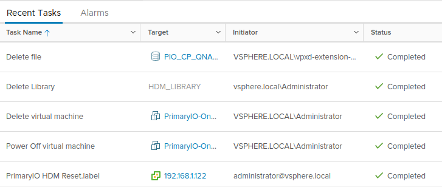

#### **IP Allocation**

HDM supports DHCP and static IP protocols. The protocol to be used must be selected during the HDM deployment process. When choosing static IP, an IP allocation range must be provided. The number of IPs required will depend on the number of nodes in the cluster and the deployment mode chosen. 

**NOTE**: HDM does not support the change of IP of its components (Appliance as well as other component VMs). Redeployment is required if IP for HDM components needs to be changed. 

### **OS Requirements**

There are no OS limitations for cold migration. 

### System Requirements

**On-premises Environment**

*   VMware Environment
    *   HDM only supports a single version of ESX throughout the vCenter cluster. Currently, only ESX versions 6.5 and 6.7 are supported.
*   vCenter Web Client: version 6.5 or 6.7
    *   Please note that the OVF file on the vCenter web client is the only supported installation method.
    *   An HTML client is recommended. 
*   The HDM appliance should be deployed on the vCenter and datacenter it will manage. It is recommended that the appliance be deployed on a cluster that will not be migrated.
*   HDM appliance sizing: Refer to the HDM Resource Requirements section.
*   The datastore should be one of the following formats: VMFS, NFS, NFSv3.
*   HDM components should be deployed on a shared datastore.
*   DRS and HA should only be enabled on the vCenter cluster. 
*   E1000E and VMXNet3 network adapter support should be available on the on-premises vCenter.
*   Hardware Environment
    *   Network: At least 1 Gbps
*   Browser: Chrome v75 or above
*   Network requirement:
    *   An on-premises network called ON_PREM_HDM_NETWORK needs to be created for HDM component interactions (**HDM Internal Network** mentioned in the Network Types section).

        **NOTE**: Creating a new network, ON_PREM_HDM_NETWORK, is not mandatory. HDM can be configured for traffic to utilize one of the existing networks. However, having a separate network is recommended to maintain network isolation. 

    *   At least a 1 Gbps link; a 10 Gbps link is preferred.
    *   HDM appliance should have access to the following:
        *   VM Network (Management Network) - to access and manage virtual machines on 6.x the vCenter.
        *   HDM_Internal_Network (HDM Internal Network) - for HDM component heartbeat and RTO/RPO data sync to on-premises VMs
        *   Uplink_WAN_Network (WAN Network) - for connectivity to cloud endpoints for HDM deployment and migration
        *   ESXi_Network (ESXi Network) – to provide access to ESXi through the VM network. Required for IOA analysis and data transfer
        *   HDM appliance should be accessible from ESXi servers of the source cluster
    *   HDM appliance should have access to the cloud vCD and ESXi servers on port 443.
    *   ESXi should provide access to the HDM appliance from all IPs to ports 22 and 443.
    *   For hardware and system requirements, refer to the [VMware Hardware Compatibility List (HCL).](https://www.vmware.com/resources/compatibility/search.php)

**NOTES**:

1. Currently, HDM only supports migration of one cluster per vCenter at a time. If VMs need to be migrated from multiple clusters, the process of deploy, migrate, and undeploy must be repeated for each of the clusters.
2. VM Network (Management Network), HDM_Internal_Network (HDM Internal Network), Uplink_WAN_Network (WAN Network) and ESXi_Network (ESXi Network) can map to a single network or multiple networks. In the event that a single network provides all of this functionality, details would still need to provided for each. In this case, the IP subnet can be divided into multiple ranges that can be mapped to each of the four networks.

    For example, for a network 192.168.1.0/24, the IP ranges can be used as follows:

*   192.168.1.2 - 192.168.1.20 (VM Network)
*   192.168.1.21 - 192.168.1.40 (ESXi_Network)
*   192.168.1.41 - 192.168.1.60 (Uplink_WAN_Network)
*   192.168.1.61 - 192.168.1.80 (HDM_Internal_Networking)

#### **Cloud Requirements**

*   Supported Cloud endpoints:
    *   VMware Cloud Director 9.7
    *   VMware Cloud Director 10.1
*   Network connectivity between on-premises and cloud environments
    *   Network Link: at least 1 Gbps
    *   Network Round Trip Time Latencies: less than 30 ms
*   Network requirement:
    *   Create ON_CLOUD_HDM_NETWORK (HDM Internal Network). All cloud HDM components should be deployed on this network. A 10 Gbps link is recommended. 

        **NOTE**: Creating a new network as ON_CLOUD_HDM_NETWORK is not mandatory. HDM can be configured for traffic to utilize one of the existing networks. However, having a separate network is recommended to maintain network isolation.

    *   Cloud HDM components should have access to the WAN.
    *   Firewall rules for HDM cloud access:
        *   Port 22 - inbound and outbound
        *   Port 2379 - outbound 
        *   Port 6000-6010 - inbound and outbound
        *   Port 7000-7010 - inbound and outbound
        *   Port 8000-8010 - inbound and outbound
        *   Post 32820 - inbound and outbound

## Deployment Checklist

To assist in deployment efforts, a check-list, HDM 2.1 Deployment Checklist.pdf, is included** **in the HDM package. Completing the checklist and ensuring that all required information is available is recommended prior to beginning the deployment.

## HDM Deployment Steps

HDM deployment involves the following six steps, each of which is discussed in detail in the sections below:

1. Deploy the HDM appliance on-premises
2. Add the on-premises vCenter to the HDM appliance
3. Register the HDM plug-in to the on-premises vCenter
4. Add the HDM license
5. Deploy HDM on-premises
6. Deploy HDM in the cloud

### Step 1: Deploy the HDM Appliance On-premises

#### Placement of HDM Appliance

1. The appliance must be deployed on the same on-premises vCenter it will manage.
2. The appliance should reside in a different cluster than the one it will manage for migrations.

#### System Requirements for the Appliance 

Please see the section on 

>>>>>  gd2md-html alert: undefined internal link (link text: "HDM Resource Requirements"). Did you generate a TOC?  (<a href="#">Back to top</a>)(<a href="#gdcalert8">Next alert</a>) >>>>> 

[HDM Resource Requirements](#heading=h.3hg9zwdhl9h3). 

#### Deployment and Configuration

The HDM appliance must be installed from the OVF in the HDM package. Be sure to check that the placement and sizing of the deployment conforms to the requirements mentioned above. To deploy the appliance, use the “Deploy OVF Template**” **option in vCenter (figure 6).

_Figure 6: Launching the “Deploy OVF” Template in vCenter_

>>>>>  gd2md-html alert: inline image link here (to images/image5.png). Store image on your image server and adjust path/filename/extension if necessary.  (<a href="#">Back to top</a>)(<a href="#gdcalert9">Next alert</a>) >>>>> 

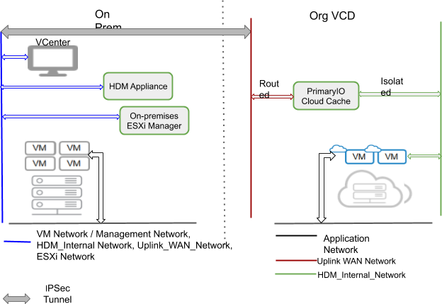

#### Network Configuration for the Appliance

Appliance network configuration requires that the available networks be categorized into four types, described in the Network Requirements  and HDM Resource Requirements sections, above. While it is recommended to keep these networks separate, it is possible for each of them to point to a single network. In addition, the decision must be made at this point to deploy using a static IP or DHCP protocol (figure 7).

_Figure 7: Configuring the Network_

>>>>>  gd2md-html alert: inline image link here (to images/image6.png). Store image on your image server and adjust path/filename/extension if necessary.  (<a href="#">Back to top</a>)(<a href="#gdcalert10">Next alert</a>) >>>>> 

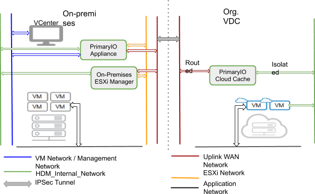

#### IP Address Details

(_If DHCP is chosen, this section can be skipped)_

For each network type, choose the IP allocation protocol: static or DHCP. The following details are required if static IP is chosen (figure 8):

*   IP range: list of IP addresses that are free to be allocated to various HDM components
*   Subnet mask: subnet of the IP range
*   Gateway: gateway IP of the network
*   Domain: domain name of the network
*   DNS: domain name translation for the IP address
*   NTP: server that will be used for time synchronization

**NOTES**:

1. If static IP is chosen, failure to specify an NTP server may cause further HDM operations to fail.
2. If static IP is chosen, the gateway IP and the specified IP range must be in the same subnet.

_Figure 8: Configuring the System for Static IP Protocol_

>>>>>  gd2md-html alert: inline image link here (to images/image7.png). Store image on your image server and adjust path/filename/extension if necessary.  (<a href="#">Back to top</a>)(<a href="#gdcalert11">Next alert</a>) >>>>> 

#### Power on the Appliance

Complete the rest of the wizard and wait for the deployment to complete. Then, use vCenter to power on the appliance.

#### Enable VMware HA on the Appliance

(_This step should only be performed for HDM cluster mode deployments_)

VMware HA should be enabled on the cluster where the HDM appliance has been deployed. To complete this procedure, do the following:

1. In the on-premises vCenter, select the cluster where the HDM appliance is deployed
2. Select the “Configure” tab from the right-hand pane and navigate to _Services_ 🡪 _vSphere Availability_
3. If the vSphere HA is turned off, select _EDIT_ and _Enable vSphere HA_

### Step 2: Add the On-premises vCenter to the HDM Appliance

**NOTE**: The On-premises vCenter should be added to the same location as the HDM appliance. 

Pre-requisites

1. Ensure that the HDM appliance is powered on and valid vCenter administrator credentials are available.

Steps

1. Log into the HDM Appliance by accessing _https://&lt;appliance ip>_ in a supported web browser and enter the administrator credentials. The default administrator username and password are _‘administrator’_ and _‘2Hdm$aK!N@h!’,_ respectively. The default password should be changed immediately after the first login.
2. Select _vCenters_ from the top pane.
3. Select _Add vCenter_ at the top right (figure 9).

_Figure 9: Adding vCenter to the HDM Appliance_

>>>>>  gd2md-html alert: inline image link here (to images/image8.png). Store image on your image server and adjust path/filename/extension if necessary.  (<a href="#">Back to top</a>)(<a href="#gdcalert12">Next alert</a>) >>>>> 

4. Specify the on-premises vCenter IP, or the FQDN that was set for the vCenter during its installation. Enter the administrator credentials, and then select _Add vCenter_. The HDM appliance should now list the on-premises vCenter (figure 10).

_Figure 10: Viewing the On-Premises vCenter on the HDM Appliance_

>>>>>  gd2md-html alert: inline image link here (to images/image9.png). Store image on your image server and adjust path/filename/extension if necessary.  (<a href="#">Back to top</a>)(<a href="#gdcalert13">Next alert</a>) >>>>> 

## Step 3: Register the HDM Plug-in to On-premises vCenter

1. Select _Register** **_to register the HDM plug-in to on-premises vCenter.
2. Logout, then login twice from the vCenter for the plug-in installation to complete. Successful installation should add an HDM icon to the vCenter home page (figure 11). Sometimes, multiple login/logout cycles may be required for this step to complete.

_Figure 11: HDM Icon on the vCenter Home Page_

>>>>>  gd2md-html alert: inline image link here (to images/image10.png). Store image on your image server and adjust path/filename/extension if necessary.  (<a href="#">Back to top</a>)(<a href="#gdcalert14">Next alert</a>) >>>>> 

**NOTE:** The PrimaryIO vCenter plug-in will be automatically registered on all vCenter instances that are configured in enhanced linked mode.

## Step 4: Add the HDM License

Following deployment, a license key is required to activate HDM. A trial license will be shared with the product which can be used to activate HDM.

**NOTE**: Initial product settings need to be initialized, so it may take a few minutes to load the HDM configuration page.

Steps to add the HDM license:

1. In the on-premises vCenter, access the HDM dashboard by selecting _HDM_ from _Shortcuts_ or the vCenter menu (_It may take a few minutes for the dashboard to load)_.
2. Select the _Administration** **_tab.
3. Select _Licensing_ to add a new license, and to see existing licenses (figure 12).
4. Select _Add License** **_to open a popup where the provided **Trial License** can be pasted (figure 13).
5. Copy and paste the shared license key and select _OK_. The license will now be listed on the license page (figure 14).
6. The same interface can then be used to add the actual **Product License** obtained as part of the ordering process.

_Figure 12: Add or See HDM Licenses_

>>>>>  gd2md-html alert: inline image link here (to images/image11.png). Store image on your image server and adjust path/filename/extension if necessary.  (<a href="#">Back to top</a>)(<a href="#gdcalert15">Next alert</a>) >>>>> 

_Figure 13: "Add License" Pop-up_

>>>>>  gd2md-html alert: inline image link here (to images/image12.png). Store image on your image server and adjust path/filename/extension if necessary.  (<a href="#">Back to top</a>)(<a href="#gdcalert16">Next alert</a>) >>>>> 

 

_Figure 14: Verify the Addition of the Trial License_

>>>>>  gd2md-html alert: inline image link here (to images/image13.png). Store image on your image server and adjust path/filename/extension if necessary.  (<a href="#">Back to top</a>)(<a href="#gdcalert17">Next alert</a>) >>>>> 

## Step 5: Deploy HDM On-premises

Depending on the network bandwidth and storage, it may take between 10 and 20 minutes to deploy HDM on-premises. Any failure-retries during the deployment process will be logged into vCenter Events. To search for events generated by HDM,** _hdm_** or _com.primaryio_ keywords can be used in vCenter event search.

Pre-requisites:

At this point, it is assumed that the HDM appliance deployment and configuration steps have been successfully completed. Ensure that the HDM plug-in has been registered on vCenter and the HDM icon is visible on the vCenter home screen. A valid HDM license must be added to activate the product.

Deployment steps:

1. To access the HDM dashboard from the on-premises vCenter, select _HDM_ from _Shortcuts_ or the Menu.
2. Select the _Administration** **_tab, followed by _Configuration_ to access the on-premises cluster listing (figure 15). 

_Figure 15: vCenter On-Premises Cluster Listing_

>>>>>  gd2md-html alert: inline image link here (to images/image14.png). Store image on your image server and adjust path/filename/extension if necessary.  (<a href="#">Back to top</a>)(<a href="#gdcalert18">Next alert</a>) >>>>> 

3. Select the cluster where the HDM will be installed and select _Install_. This will open the HDM Installation Wizard (figure 16).
4. Verify that the HDM appliance IP address is correct.
5. Select the desired deployment mode based on your scale and failure tolerance requirements. See the Deployment Requirements section for details on the various deployment modes.
6. Select resource allocation based on your size and resource requirements. See Deployment Requirements section for details on the various allocation types.

_Figure 16: HDM Installation Wizard_

>>>>>  gd2md-html alert: inline image link here (to images/image15.png). Store image on your image server and adjust path/filename/extension if necessary.  (<a href="#">Back to top</a>)(<a href="#gdcalert19">Next alert</a>) >>>>> 

    **NOTE: **For migration to vCD, select _Ultra-Lite_ as the resource allocation mode.** **

7. Select the resource pool and shared datastore where the HDM components will be deployed (figure 17). Before selecting the deployment mode, take care to ensure that enough resources are available on-premises and in the cloud.

_Figure 17: Resource Pool and Shared Datastore Selection_

>>>>>  gd2md-html alert: inline image link here (to images/image16.png). Store image on your image server and adjust path/filename/extension if necessary.  (<a href="#">Back to top</a>)(<a href="#gdcalert20">Next alert</a>) >>>>> 

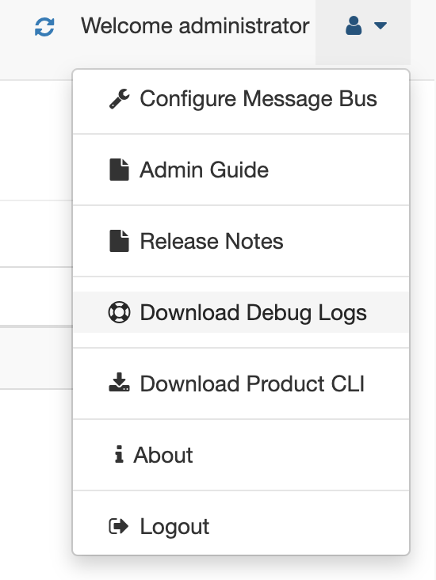

8. To specify the internal network configurations, start by choosing the IP allocation protocol: static or DHCP (figure 18). The following details are required if static IP is chosen:
*   IP range
*   Subnet mask
*   Gateway
*   Domain
*   DNS
*   NTP

    See the Deployment Requirements section for additional details on these requirements. These steps must be repeated for the following components:

1. HDM Internal Network (HDM_Internal_Network)
2. WAN Network (Uplink_WAN_Network)
3. ESXi Network (ESXi_Network)

    **NOTES: **

1. If all are mapping to single network, separate IP ranges must be provided for each network type.
2. The subnet range 172.17.0.0/16 is not available for the deployment; it is used internally by HDM microservices.

_Figure 18: Network Configuration Settings_

>>>>>  gd2md-html alert: inline image link here (to images/image17.png). Store image on your image server and adjust path/filename/extension if necessary.  (<a href="#">Back to top</a>)(<a href="#gdcalert21">Next alert</a>) >>>>> 

9. Confirm the selection and submit the installation request by clicking on the **FINISH** button (figure 19).

_Figure 19: HDM Installation Summary_

>>>>>  gd2md-html alert: inline image link here (to images/image18.png). Store image on your image server and adjust path/filename/extension if necessary.  (<a href="#">Back to top</a>)(<a href="#gdcalert22">Next alert</a>) >>>>> 

10. This will create a deployment task which can be monitored from vCenter Tasks. The deployment progress can also be seen in the HDM Configuration view within vCenter (figure 20).

_Figure 20: vCenter HDM Configuration View_

>>>>>  gd2md-html alert: inline image link here (to images/image19.png). Store image on your image server and adjust path/filename/extension if necessary.  (<a href="#">Back to top</a>)(<a href="#gdcalert23">Next alert</a>) >>>>> 

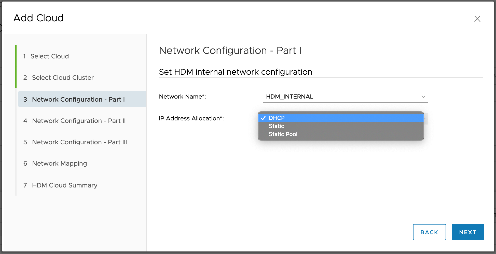

## Step 6: Deploy HDM in the Cloud

Depending on the WAN bandwidth and WAN latency, it may take between 10 and 20 minutes to deploy HDM components in the cloud. Any failure-retries during the deployment process will be logged into vCenter Events. To search for events generated by HDM,** _hdm_** or _com.primaryio_ keywords can be used in vCenter event search.

Pre-requisites 

1. Ensure that the HDM plug-in has been registered on vCenter and the HDM icon is visible on the home screen. 
2. Ensure that the on-premises deployment has successfully completed.
3. Ensure that the vCenter cloud is reachable from the HDM appliance. If cloud vCD is on the WAN and the WAN is not reachable through the appliance’s default route, then a static entry must be added to the HDM appliance to reach the cloud vCD. This can be accomplished by following these steps:
    1. vim /etc/pio.routes and add the entry `ens256|&lt;cloud_subnet>|&lt;gateway_to_access_cloud>`

        Example: ens256|10.3.0.0/24|10.1.0.1

    2. /usr/bin/setup/network.sh
4. HDM_INTERNAL_NETWORK and WAN Network should be connected to the selected vApp.

Deployment steps:

1. To access the HDM dashboard from the on-premises vCenter, select _HDM_ from _Shortcuts_ or the Menu.
2. Select the _Administration** **_tab, then _Clouds_ to access the cloud listing (figure 21).

_Figure 21: vCenter Cloud Listing_

>>>>>  gd2md-html alert: inline image link here (to images/image20.png). Store image on your image server and adjust path/filename/extension if necessary.  (<a href="#">Back to top</a>)(<a href="#gdcalert24">Next alert</a>) >>>>> 

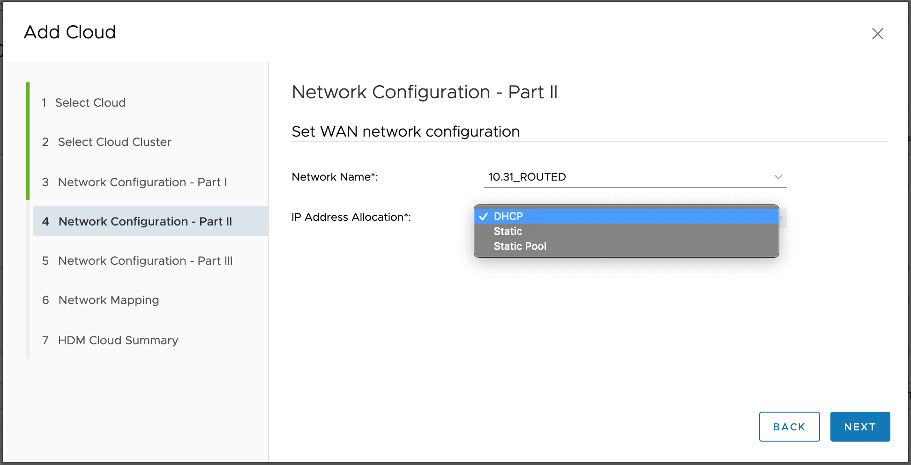

3. Select _Add Cloud.** **_This will open the HDM Cloud Wizard (figure 22).
4. Select the Cloud type and enter your vCD credentials and the Cloud DNS. 

_Figure 22: HDM Cloud Wizard_

>>>>>  gd2md-html alert: inline image link here (to images/image21.png). Store image on your image server and adjust path/filename/extension if necessary.  (<a href="#">Back to top</a>)(<a href="#gdcalert25">Next alert</a>) >>>>> 

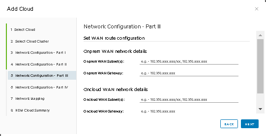

5. Select vDC, vApp and storage profile cloud where HDM components will be deployed (figure 23). 

_Figure 23: Select Cloud Cluster_

>>>>>  gd2md-html alert: inline image link here (to images/image22.png). Store image on your image server and adjust path/filename/extension if necessary.  (<a href="#">Back to top</a>)(<a href="#gdcalert26">Next alert</a>) >>>>> 

6. Select the network and IP configuration for ON_CLOUD_HDM_NETWORK (HDM Internal Network) that will be used by HDM for VM boot and subsequent IO handling through the HDM components. Choose the IP allocation protocol: static, static pool, or DHCP (figure 24). If static IP address allocation is chosen, the unused IP addresses or IP ranges, along with the gateway and subnet mask, would need to be specified.

_Figure 24: Network Configuration_

>>>>>  gd2md-html alert: inline image link here (to images/image23.png). Store image on your image server and adjust path/filename/extension if necessary.  (<a href="#">Back to top</a>)(<a href="#gdcalert27">Next alert</a>) >>>>> 

7. Select network IP configurations for the WAN. Choose the IP allocation protocol: static, static pool, or DHCP (figure 25). If static IP address allocation is chosen, the unused IP addresses or IP ranges, along with the gateway and subnet mask, domain search path, and one or more DNS and NTP servers, would need to be specified

_Figure 25: WAN Configuration_

>>>>>  gd2md-html alert: inline image link here (to images/image24.png). Store image on your image server and adjust path/filename/extension if necessary.  (<a href="#">Back to top</a>)(<a href="#gdcalert28">Next alert</a>) >>>>> 

8. Set WAN route configuration to enable data traffic to travel from the cloud to the on-premises environment (figure 26). See Deployment Requirements section for details.

_Figure 26: WAN Route Configuration_

>>>>>  gd2md-html alert: inline image link here (to images/image25.png). Store image on your image server and adjust path/filename/extension if necessary.  (<a href="#">Back to top</a>)(<a href="#gdcalert29">Next alert</a>) >>>>> 

9. Select network mapping to enable the on-premises network categorization to also be applied to cloud components (figure 27).

_Figure 27: Network Mapping_

>>>>>  gd2md-html alert: inline image link here (to images/image26.png). Store image on your image server and adjust path/filename/extension if necessary.  (<a href="#">Back to top</a>)(<a href="#gdcalert30">Next alert</a>) >>>>> 

10. To submit the request and initiate the cloud deployment, select _FINISH_. This will create deployment tasks for the cloud components, which can be monitored in vCenter Tasks. The progress can also be seen in the HDM Clouds view (figure 29).

_Figure 28: Summary and Request Submission_

>>>>>  gd2md-html alert: inline image link here (to images/image27.png). Store image on your image server and adjust path/filename/extension if necessary.  (<a href="#">Back to top</a>)(<a href="#gdcalert31">Next alert</a>) >>>>> 

_Figure 29: HDM Clouds View_

>>>>>  gd2md-html alert: inline image link here (to images/image28.png). Store image on your image server and adjust path/filename/extension if necessary.  (<a href="#">Back to top</a>)(<a href="#gdcalert32">Next alert</a>) >>>>> 

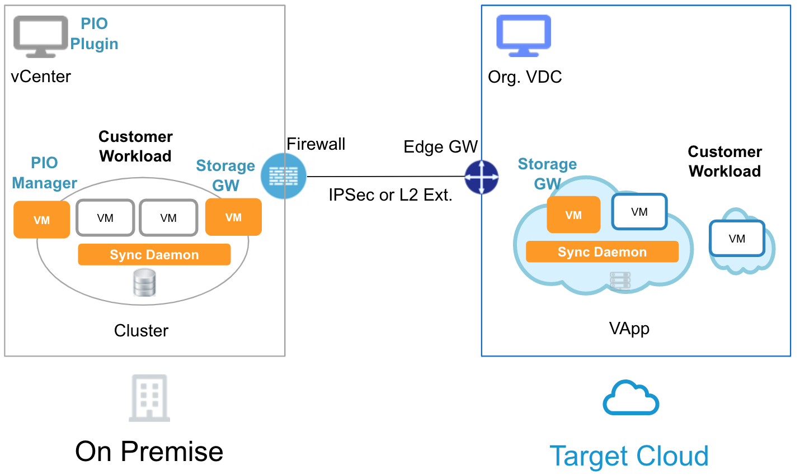

## Deployment Validation

Once the on-premises and cloud deployments have completed, the state of the components can be viewed in the following ways:

### Appliance View

After successful installation of HDM in the cloud, the HDM appliance control panel shows the list of components and their health (figure 30). This information can also be viewed from the HDM plug-in in vCenter (figure 31).

_Figure 30: HDM Appliance Control Panel_

>>>>>  gd2md-html alert: inline image link here (to images/image29.png). Store image on your image server and adjust path/filename/extension if necessary.  (<a href="#">Back to top</a>)(<a href="#gdcalert33">Next alert</a>) >>>>> 

_Figure 31: vCenter HDM Plug-In_

>>>>>  gd2md-html alert: inline image link here (to images/image30.png). Store image on your image server and adjust path/filename/extension if necessary.  (<a href="#">Back to top</a>)(<a href="#gdcalert34">Next alert</a>) >>>>> 

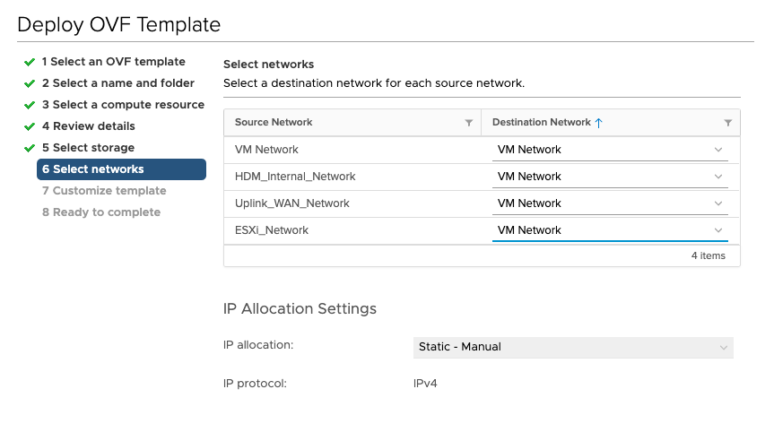

### On-premises vCenter

To verify that the on-premises vCenter shows the cloud state as installed, select _HDM_, then the _Administration_ and _Clouds _tabs. 

_Figure 32: Verify Installation of the Cloud State_

>>>>>  gd2md-html alert: inline image link here (to images/image31.png). Store image on your image server and adjust path/filename/extension if necessary.  (<a href="#">Back to top</a>)(<a href="#gdcalert35">Next alert</a>) >>>>> 

**NOTE:** Configuration information needs to be gathered and loaded from vCD, so it may take a few minutes to load the Cloud Dashboard for the first time. 

# HDM Migrations

HDM is used to perform VM migrations from on-premises environments to the cloud. Detailed use cases and procedure for using HDM for migrate operations are explained in **HDM 2.1 Admin Guide.pdf.**

# HDM Undeployment

## Steps for HDM Undeployment

HDM undeployment consists of the following four steps:

1. Undeploy HDM in the cloud
2. Undeploy HDM on-premises
3. Unregister the HDM vCenter plug-in
4. Delete the HDM appliance from vCenter

## Step 4: Undeploy HDM in the Cloud

Steps

1. In the on-premises vCenter, access the HDM dashboard by selecting _HDM_ from _Shortcuts_ or from the Menu.
2. Select the _Administration** **_tab, then _Clouds_ to access the Cloud listing (figure 33).
3. Choose the cloud from the listing and select _DELETE CLOUD_

_Figure 33: vCenter Cloud Listing_

>>>>>  gd2md-html alert: inline image link here (to images/image32.png). Store image on your image server and adjust path/filename/extension if necessary.  (<a href="#">Back to top</a>)(<a href="#gdcalert36">Next alert</a>) >>>>> 

4. Select _OK_ on the _Delete Cloud_ pop-up (figure 34) to begin the undeployment process.

_Figure 34: Delete Cloud Pop-Up_

>>>>>  gd2md-html alert: inline image link here (to images/image33.png). Store image on your image server and adjust path/filename/extension if necessary.  (<a href="#">Back to top</a>)(<a href="#gdcalert37">Next alert</a>) >>>>> 

5. This will create an undeployment task for the cloud components. The task can be monitored in _vCenter Tasks_. The progress can be seen in the _HDM Clouds _view (figure 35).

_Figure 35: HDM Clouds View_

>>>>>  gd2md-html alert: inline image link here (to images/image34.png). Store image on your image server and adjust path/filename/extension if necessary.  (<a href="#">Back to top</a>)(<a href="#gdcalert38">Next alert</a>) >>>>> 

## Step 2: Undeploy HDM On-premises

Pre-requisites

1. Ensure that the cloud undeploy completed successfully.

Steps

1. To access the HDM dashboard, select _HDM_ from _Shortcuts_ or from the Menu in the on-premises vCenter.
2. Select the _Administration** **_tab, then _Configuration_ to access the cluster listing (figure 36)
3. Choose the cluster where HDM is installed and select _UNINSTALL**. **_

_Figure 36: vCenter On-Premises Cluster Listing_

>>>>>  gd2md-html alert: inline image link here (to images/image35.png). Store image on your image server and adjust path/filename/extension if necessary.  (<a href="#">Back to top</a>)(<a href="#gdcalert39">Next alert</a>) >>>>> 

4. Select _OK_ in the Uninstall On-premises pop-up (figure 37).

_Figure 37: Uninstall On-Premises Pop-up_

>>>>>  gd2md-html alert: inline image link here (to images/image36.png). Store image on your image server and adjust path/filename/extension if necessary.  (<a href="#">Back to top</a>)(<a href="#gdcalert40">Next alert</a>) >>>>> 

5. This will create an undeployment task for the on-premises components. The task can be monitored in _vCenter Tasks_. The progress can be seen in the _HDM Configuration _view (figure 38).

_Figure 38: HDM Configuration View_

>>>>>  gd2md-html alert: inline image link here (to images/image37.png). Store image on your image server and adjust path/filename/extension if necessary.  (<a href="#">Back to top</a>)(<a href="#gdcalert41">Next alert</a>) >>>>> 

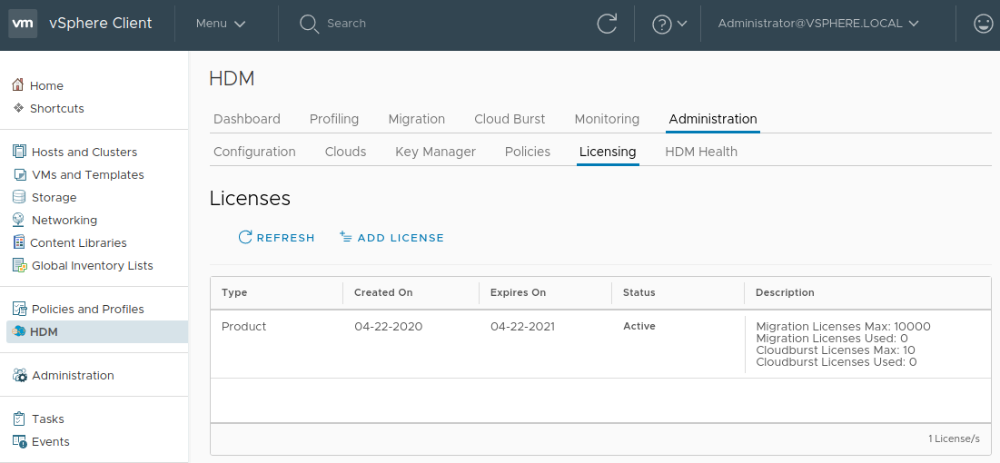

## Step 3: Unregister HDM vCenter Plug-in

Unregistering the HDM plug-in causes the HDM icon to get removed from the vCenter.

Steps

1. Access the HDM appliance from the browser.
2. Log into the HDM appliance using the administrator credentials.
3. Select _vCenters_ tab to view the PrimaryIO vCenter listing (figure 39).
4. Choose the vCenter, then select _Unregister._
5. Once the unregister is successful, the HDM icon should not appear in the vCenter menu. However, you must logout and re-login to vCenter to see the change.

_Figure 39: HDM Plug-In in the PrimaryIO vCenter Listing_

>>>>>  gd2md-html alert: inline image link here (to images/image38.png). Store image on your image server and adjust path/filename/extension if necessary.  (<a href="#">Back to top</a>)(<a href="#gdcalert42">Next alert</a>) >>>>> 

## Step 4: Delete the HDM Appliance from vCenter

Pre-requisites 

1. Ensure that the HDM plug-in has been unregistered.

Steps

1. Access the HDM Appliance from the browser.
2. Log into the HDM appliance using the administrator credentials.
3. Select _vCenters_ tab to view the PrimaryIO vCenter listing (figure 40).
4. Choose the vCenter, then select _Delete_.
5. In the pop-up, select _Yes** **_to delete vCenter from the HDM appliance.
6. Log into vCenter.
7. Select _Host_ and _Clusters_, then power off the HDM Appliance.
8. Right-click on the HDM appliance and select _Delete From Disk_ to delete the HDM appliance.

_Figure 40: HDM Appliance in the PrimaryIO vCenter Listing_

>>>>>  gd2md-html alert: inline image link here (to images/image39.png). Store image on your image server and adjust path/filename/extension if necessary.  (<a href="#">Back to top</a>)(<a href="#gdcalert43">Next alert</a>) >>>>> 

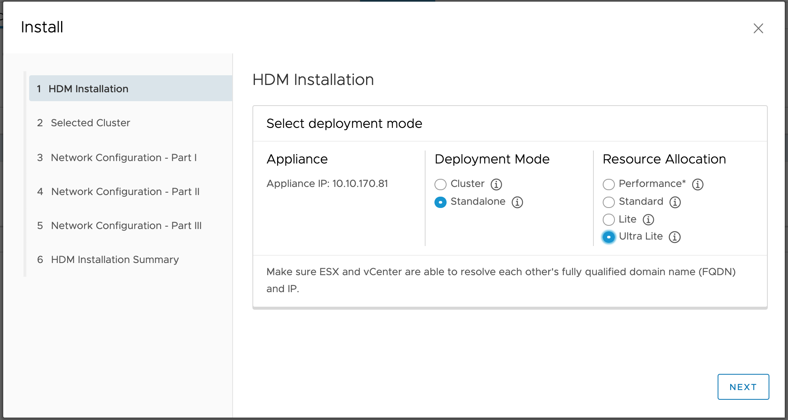

# TroubleShooting

## HDM Support Logs

If you require technical support for HDM, you will need to provide the HDM support logs and VMware support logs from the deployed system. The collected logs must be provided to HDM support, along with a description of the issue.

### Download HDM Logs

Pre-requisites

1. HDM appliance must be powered on.

Steps for download

1. Log into the HDM appliance by accessing _https://&lt;appliance ip>_ in a supported web browser. 
2. Select the user profile icon in the top right corner, and choose _Download Debug Logs_ (figure 41).
3. A zip file named _pio_logs.zip_ will be downloaded. This file can be sent as an attachment for further analysis of the issue.

_Figure 41: Downloading Debug Logs from HDM_

>>>>>  gd2md-html alert: inline image link here (to images/image40.png). Store image on your image server and adjust path/filename/extension if necessary.  (<a href="#">Back to top</a>)(<a href="#gdcalert44">Next alert</a>) >>>>> 

### Download _VMware support_ logs

Steps:

1. Log into the on-premises vCenter from the vSphere web client. Right-click on the vCenter IP and select _Export System Logs_ (figure 42).
2. From the _Select Hosts_ page, select the hosts that are part of the cluster where HDM is installed. Also select the _Include vCenter and vSphere Web Client Logs_ option.
3. Complete the rest of the wizard to generate a zip file containing the _VMware support_ _logs_ from the vCenter and ESXi hosts.

_Figure 42: Downloading System Logs from vCenter_

>>>>>  gd2md-html alert: inline image link here (to images/image41.png). Store image on your image server and adjust path/filename/extension if necessary.  (<a href="#">Back to top</a>)(<a href="#gdcalert45">Next alert</a>) >>>>> 

## HDM Reset

**CAUTION: Use this functionality with caution, as this can lead to HDM configuration data loss. This should _only_ be used when the system has entered an unrecoverable state.**

_HDM Reset_ is used to recover from situations when HDM enters into an unrecoverable state. It removes all cloud and on-premises component states, and is equivalent to a factory reset. HDM Reset is usually followed by re-deployment of HDM.

### What HDM Reset Won’t Do

HDM reset is not about removing all states. It only removes the states that are required to bring the system back to a point where HDM can be reinstalled.

1. It will not remove storage policies.
2. The VAIO component will not be removed from EXSi. 
3. It will not uninstall or unregister the vCenter plug-in.

### When to Perform HDM Reset

The few cases where HDM Reset may be required are:

*   **Multiple HDM components are simultaneously failing.** HDM tries to recover from multiple component failures. However, this will likely require an HDM reset.
*   **Prolonged WAN outages.** HDM can handle transient network failures, but long outages (greater than 5 minutes) may render it incapable of recovering.
*   **Component recovery failure for an extended period of time**. HDM will attempt to recover the failed components a few times. But if the failure condition does not disappear, the component recovery may continue to fail indefinitely. This may be the case if the Control Panel in the HDM appliance shows the components in the degraded state for more than 15 minutes.
*   **_Reset Required_ message received. **If HDM logs the following message in the on-premises vCenter: “Fatal Unrecoverable failure detected in HDM component: &lt;component_name> Please reset the HDM system and retry migration operations for the VMs in &lt;vm_name> and &lt;pool_name> resource pools”

### HDM Reset Steps

Pre-requisites

1. HDM appliance must be powered on.

Steps

1. To access the HDM dashboard, select _HDM_ from _Shortcuts_ or from the Menu in the on-premises vCenter.
2. Select the _Administration_ tab,** **then _HDM Health_ and** _HDM Reset_** (figure 43). If the _HDM Reset_ button is not enabled, then reboot the HDM appliance and try again.
3. Select the _HDM RESET_ button to trigger the reset.
4. You can view the task in the on-premises vCenter (figure 44).
5. Restart the HDM appliance from vCenter and wait for the restart to complete.

_Figure 43: vCenter HDM Reset Tab_

>>>>>  gd2md-html alert: inline image link here (to images/image42.png). Store image on your image server and adjust path/filename/extension if necessary.  (<a href="#">Back to top</a>)(<a href="#gdcalert46">Next alert</a>) >>>>> 

_Figure 44: Reset Task in the On-Premises vCenter_

>>>>>  gd2md-html alert: inline image link here (to images/image43.png). Store image on your image server and adjust path/filename/extension if necessary.  (<a href="#">Back to top</a>)(<a href="#gdcalert47">Next alert</a>) >>>>> 

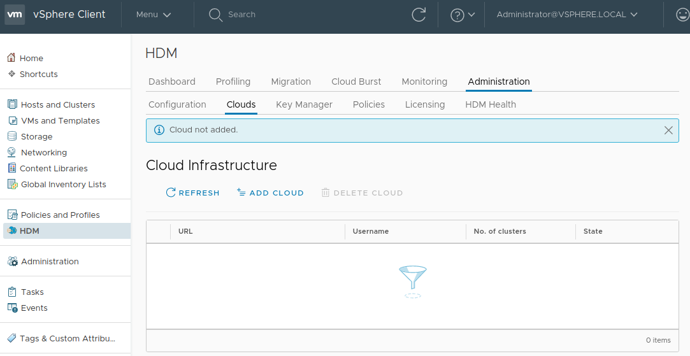

6. On restart, you should see that the earlier queued task for HDM reset in vCenter can now proceed. 
7. Once the reset is complete, the vCenter task is updated (figure 45).

_Figure 45: Updated Task in On-Premises vCenter_

>>>>>  gd2md-html alert: inline image link here (to images/image44.png). Store image on your image server and adjust path/filename/extension if necessary.  (<a href="#">Back to top</a>)(<a href="#gdcalert48">Next alert</a>) >>>>> 

8. The VMs will be migrated back and will remain in ‘_HDM_MIGRATE_POOL_’.
9. Be sure to monitor the state of the HDM components in the Control Panel of the HDM appliance to ensure that the on-premises load balancer, database, HA manager, and PrimaryIO manager are running. This will indicate the successful completion of the HDM reset.

### VM Recovery Following HDM Reset

To recover VMs following an HDM reset, the following steps should be performed:

1. Power on the VM and verify the sanity of the data
2. If the power-on and data sanity checks pass:
    1. Delete the HDM migrate time snapshot
    2. Move the VM to its pre-migration resource pool
3. If the power-on or the data sanity fail:
    3. Restore the data from the migrate time snapshot
    4. Delete the HDM migrate time snapshot
    5. Move the VM to its pre-migration resource pool
    6. Power on the VM 

### Redeployment Following an HDM Reset

As mentioned in earlier sections, a typical HDM deployment consists of the following steps:

1. Deploy the HDM appliance
2. Register the HDM plug-in
3. Deploy HDM on-premises
4. Deploy HDM in the cloud

HDM reset would undo the steps 3 and 4, above, so these have to be executed again:

1. 

>>>>>  gd2md-html alert: undefined internal link (link text: "Deploy HDM on-premises"). Did you generate a TOC?  (<a href="#">Back to top</a>)(<a href="#gdcalert49">Next alert</a>) >>>>> 

[Deploy HDM on-premises](#heading=h.dbn9uqe840qe)
2. 

>>>>>  gd2md-html alert: undefined internal link (link text: "Deploy HDM in the cloud"). Did you generate a TOC?  (<a href="#">Back to top</a>)(<a href="#gdcalert50">Next alert</a>) >>>>> 

[Deploy HDM in the cloud](#heading=h.dbn9uqe840qe)

## Troubleshooting Common Failure Scenarios

Common failure scenarios and their possible reasons are discussed below. If the failure is not one of the above reasons and the error message is not clear, please contact PrimaryIO Support.

### Deployment Failures

Some common reasons for deployment failures are:

1. **Insufficient resources. **On-premises or cloud resources are not sufficient to meet the requirements for the specified deployment mode.
2. **Unresolved input values.** Inputs such as vCenter FQDN/IP are either unresolvable or unreachable.
3. **IP range issues.** For static IP allocation, the specified IP range is insufficient for all HDM components.
4. **HDM component failed during or after the deployment.** The HDM component failed during deployment.

Usually, the deployment UI wizard or vCenter tasks fail with error message pointing to one of the above reasons. The errors can be rectified and either a re-deployment can be initiated or an HDM reset followed by re-deployment should be attempted.

### Undeployment Failures

Common reasons for undeployment failures are:

1. VMs are still migrated to the cloud when undeployment is attempted. (This is applicable to TBC only)
2. The on-premises cluster host is unable to enter maintenance mode, for one of the following reasons: 
    *   DRS is not enabled on the cluster, thereby causing powered-on VMs to block the maintenance mode
    *   The HDM appliance is part of a single host cluster. Therefore, the HDM appliance being powered-on blocks the maintenance mode. In this case, the user should immediately power off the HDM appliance.

Monitoring the vCenter tasks will provide the reason for an undeployment failure. If it is one of the above, rectify the reason for the failure and re-attempt the operation.

# Support and Contact 

    In case of any issue, HDM support can be contacted via **email: [support@primaryio.com](mailto:support@primaryio.com)**

The email should contain the following:

*   **Email subject:** Clearly highlight the issue.
*   **Email body**: Clearly describe the problem. It can contain the deployment type, the operation being performed, any relevant screenshots, etc.
*   **Email attachment**: Attach the relevant logs (see the 

>>>>>  gd2md-html alert: undefined internal link (link text: "HDM Support Logs"). Did you generate a TOC?  (<a href="#">Back to top</a>)(<a href="#gdcalert51">Next alert</a>) >>>>> 

[HDM Support Logs](#heading=h.46et8132q0kj) section for instructions):
    *   HDM logs
    *   vm-support logs

    If the attachment size is too large, an alternate shared location may be provided by HDM Support where the logs can be uploaded.
