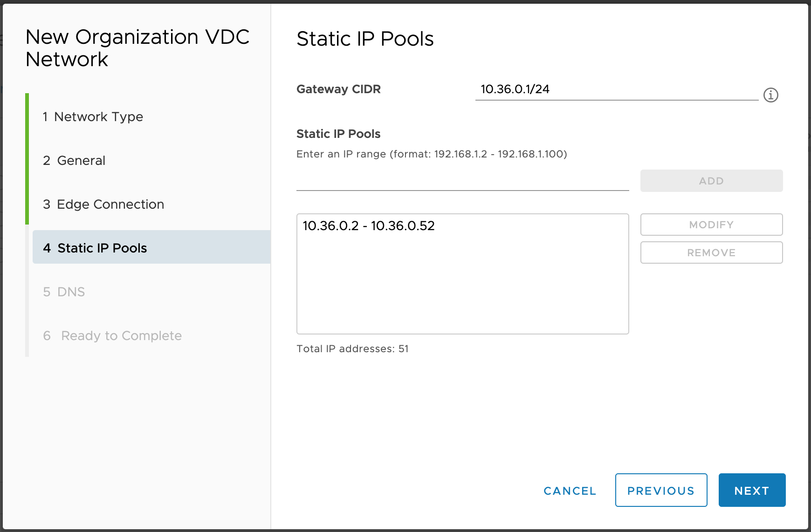
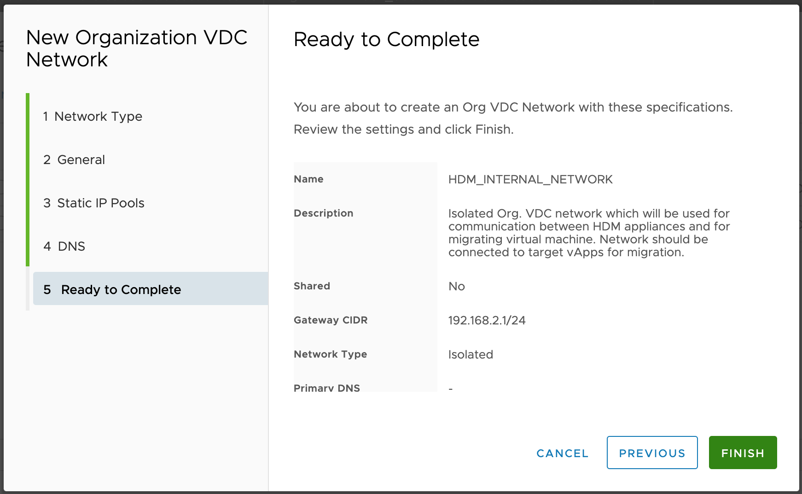
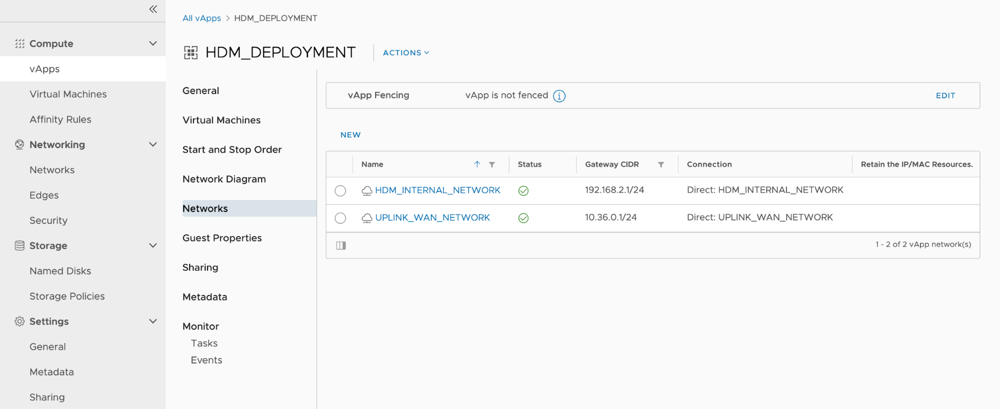

<!-- Copy and paste the converted output. -->

# **HDM 2.1 - Org VDC System and Network Configuration**

# About this Guide

The document describes the Organization VDC side network and system configuration required for HDM deployment.

# Network Configuration

## <a name="create-routed-network"> Step 1/3  : Create Routed Network UPLINK_WAN_NETWORK

This network will be connected to the edge gateway. Across WAN communication between on-premise and on-cloud for HDM appliance will be routed through this network. IPsec tunnel in [step 3](#step-3) will be configured to this network to complete the network configuration.

1. Create a new network and select Routed Network Type

2. Provide the name  “UPLINK_WAN_NETWORK” and Gateway CIDR for the network. Note the CIDR as this would be required when creating VPN connection between premise and edge gateway on cloud.

3. Select the edge gateway 

4. Specify static-ip pool of at least 20 IP addresses

5. Add DNS records if required

6. Review and click on finish to create the routed network

## 

## Step 2/3  : Create Isolated Network HDM_INTERNAL_NETWORK

This network will be created for HDM appliance communication and for migrating virtual machines across vApps for the same Org. VDC.

1. Create a new network and select Isolated Network Type

2. Provide the name “HDM_INTERNAL_NETWORK” and Gateway CIDR for the network. Make sure enough IPs are available in the subnet as this would be used for migrating virtual machines. The network would be assigned during migration and then removed post-migration.

3. Specify static-ip pool or at least 30 IPs.

4. Review and click on finish to create the isolated network

## 

## <a name="step-3"> Step 3/3  : Configure VPN tunnel with Org. Edge Gateway </a>

Create an IPSec tunnel between the organization edge gateway and on-premise datacenter. To complete the VPN setting the following information would be required:

*   Local ID - Edge gateway tenant external network IP 
*   Local Endpoint - Edge gateway tenant external network IP
*   Local Subnets - Routed network subnet where HDM appliances will be deployed ([Create Routed Network](#create-routed-network))
*   Peer ID - Public IP for the on-premise WAN network
*   Peer Endpoint - Public IP for the on-premise WAN network
*   Peer Subnets - Subnet of the on-premise WAN network where HDM appliances will be deployed.

### Edge gateway VPN config 

### Recommended firewall rules

Add recommended firewall rule by specifying source and destination subnet

### Service/Port level requirement for HDM(Advanced firewall rules)

1. Premise wan network - Cloud wan network ports(Inbound/Outbound):** **22, 2379, 32820, 2376, 6000-6050, 7000-7050, 8000-8050.

You can test the IPsec connectivity using ping command from on prem to cloud side routed network gateway. If you have configured advanced firewall rules please make sure ICMP traffic is allowed.

Ping test from premise to cloud side gateway

Ping test from Cloud to Premise IP, you need to create test machine on routed network of cloud side.

# System Configuration

## Configure vApp for HDM Deployment

The components of HDM need to be deployed on a vApp. If you don’t already have a vApp for this purpose please create it.

Attach Org VDC network UPLINK_WAN_NETWORK and HDM_INTERNAL_NETWORK which were created in step 1 and 2 earlier in this document to vApp where HDM will be deployed. 

**NOTE: HDM_INTERNAL_NETWORK should be added to all vApps where VMs will be migrated.**

