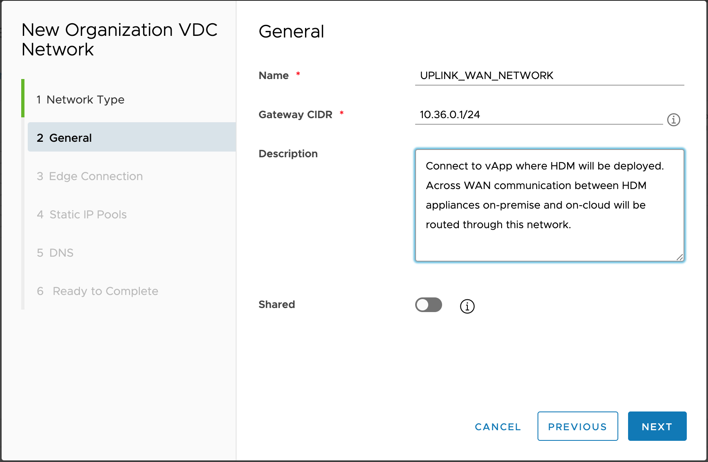
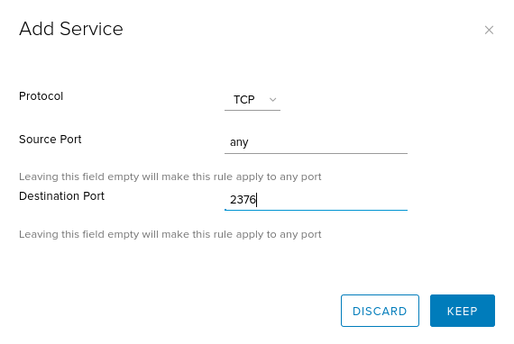

# **HDM 2.1 - Org VDC System and Network Configuration**

By now you understand the use cases for HDM, the resources 
required and the tradeoffs associated with each of the
configurations in which HDM may be deployed.

In this section we will show you how to configure the Organization VDC side network and system configuration required for HDM deployment.

# Network Configuration

## <a name="create-routed-network"> Step 1/3  : Create Routed Network UPLINK_WAN_NETWORK

This network will be connected to the edge gateway. Across WAN communication between on-premise and on-cloud for HDM appliance will be routed through this network. IPsec tunnel in [step 3](#step-3) will be configured to this network to complete the network configuration.

1. Create a new network and select Routed Network Type

2. Provide the name  “UPLINK_WAN_NETWORK” and Gateway CIDR for the network. Note the CIDR as this would be required when creating VPN connection between premise and edge gateway on cloud.

3. Select the edge gateway 

4. Specify static-ip pool of at least 20 IP addresses

5. Add DNS records if required

6. Review and click on finish to create the routed network

## 

## Step 2/3  : Create Isolated Network HDM_INTERNAL_NETWORK

This network will be created for HDM appliance communication and for migrating virtual machines across vApps for the same Org. VDC.

1. Create a new network and select Isolated Network Type

2. Provide the name “HDM_INTERNAL_NETWORK” and Gateway CIDR for the network. Make sure enough IPs are available in the subnet as this would be used for migrating virtual machines. The network would be assigned during migration and then removed post-migration.

3. Specify static-ip pool or at least 30 IPs.

4. Review and click on finish to create the isolated network

## 

## <a name="step-3"> Step 3/3  : Configure VPN tunnel with Org. Edge Gateway </a>

Create an IPSec tunnel between the organization edge gateway and on-premise datacenter. To complete the VPN setting the following information would be required:

*   Local ID - Edge gateway tenant external network IP 
*   Local Endpoint - Edge gateway tenant external network IP
*   Local Subnets - Routed network subnet where HDM appliances will be deployed ([Create Routed Network](#create-routed-network))
*   Peer ID - Public IP for the on-premise WAN network
*   Peer Endpoint - Public IP for the on-premise WAN network
*   Peer Subnets - Subnet of the on-premise WAN network where HDM appliances will be deployed.

### Edge gateway VPN config 

### Recommended firewall rules

Add recommended firewall rule by specifying source and destination subnet

### Service/Port level requirement for HDM(Advanced firewall rules)

1. Premise wan network - Cloud wan network ports(Inbound/Outbound):** **22, 2379, 32820, 2376, 6000-6050, 7000-7050, 8000-8050.

You can test the IPsec connectivity using ping command from on prem to cloud side routed network gateway. If you have configured advanced firewall rules please make sure ICMP traffic is allowed.

Ping test from premise to cloud side gateway

Ping test from Cloud to Premise IP, you need to create test machine on routed network of cloud side.

# System Configuration

## Configure vApp for HDM Deployment

The components of HDM need to be deployed on a vApp. If you don’t already have a vApp for this purpose please create it.

Attach Org VDC network UPLINK_WAN_NETWORK and HDM_INTERNAL_NETWORK which were created in step 1 and 2 earlier in this document to vApp where HDM will be deployed. 

**NOTE: HDM_INTERNAL_NETWORK should be added to all vApps where VMs will be migrated.**

# Network Configuration for Any config

1. Prerequisite for Appliance Deployment
    1. Identify Datacenter on On-Premise vCenter on which HDM will be deployed - 
    2. Identify Management network for the Datacenter (Management Network) -  
        1. Static or DHCP
        2. If Static

<table>
  <tr>
   <td>
IP
   </td>
   <td>Netmask
   </td>
   <td>Gateway
   </td>
  </tr>
  <tr>
   <td>
_
   </td>
   <td>
   </td>
   <td>
   </td>
  </tr>
</table>

    3. Identify network on which ESXI are deployed (ESXi Network)- 
        3. Static or DHCP
        4. If Static

<table>
  <tr>
   <td>
IP
   </td>
   <td>Netmask
   </td>
   <td>Gateway
   </td>
  </tr>
  <tr>
   <td>
_
   </td>
   <td>
   </td>
   <td>
   </td>
  </tr>
</table>

    4. Identify WAN network which will have connectivity to On-Cloud environment (WAN network) - 
        5. Static or DHCP
        6. If Static

<table>
  <tr>
   <td>
IP
   </td>
   <td>Netmask
   </td>
   <td>Gateway
   </td>
  </tr>
  <tr>
   <td>
   _
   </td>
   <td>
   </td>
   <td>
   </td>
  </tr>
</table>

    5. Create or Identify a network which will be used for HDM internal communication (ON_PREM_HDM_NETWORK) - 
        7. Static or DHCP
        8. If Static

<table>
  <tr>
   <td>
IP
   </td>
   <td>Netmask
   </td>
   <td>Gateway
   </td>
  </tr>
  <tr>
   <td>
   _
   </td>
   <td>
   </td>
   <td>
   </td>
  </tr>
</table>

    6. Identify network which have access to internet

<table>
  <tr>
   <td>
Gateway 
   </td>
   <td>Network (either of 1.b, 1.c, 1.d, and 1.e)
   </td>
  </tr>
  <tr>
   <td>
   _
   </td>
   <td>
   </td>
  </tr>
</table>

    7. Comma separated NTP server (Required) - 
    8. Comma separated DNS (Only if VCenter deployment is with FQDN) -
    9. Domain Search Path (Only if vCenter deployment is with FQDN) - 
2. On-Premise Deployment
    10. HDM deployment mode
        9. Ultra Lite Standalone
        10. Ultra Lite Cluster
    11. If required, add routes to access internet in appliance
    12. Cluster within the Datacenter identified for Migration - 
    13. Resource Pool within the cluster for HDM component deployment - 
    14. Shared datastore for HDM component deployment - 
    15. HDM Internal network configuration
        11. Static or DHCP
        12. If Static
            1. IP ranges 
                1. Standalone Ultra Lite - 1 IP required
                2. Cluster Ultra Lite - 2 IP required

<table>
  <tr>
   <td>
IP Range
   </td>
   <td>Netmask
   </td>
   <td>Gateway
   </td>
  </tr>
  <tr>
   <td>
   _
   </td>
   <td>
   </td>
   <td>
   </td>
  </tr>
</table>

    16. WAN network configuration
        13. Static or DHCP
        14. If Static
            2. IP ranges 
                3. Appliance Only - NA
                4. Standalone Lite - 1 IP required
                5. Standalone Standard - 1 IP required
                6. Standalone Performance - 1 IP required
                7. Cluster Lite - 2 IP required
                8. Cluster Standard - 2 IP required (where n = # ESXi)
                9. Cluster Performance - 2 IP required  (where n = #ESXi)

<table>
  <tr>
   <td>
IP Range
   </td>
   <td>Netmask
   </td>
   <td>Gateway
   </td>
  </tr>
  <tr>
   <td>
   _
   </td>
   <td>
   </td>
   <td>
   </td>
  </tr>
</table>

    17. ESXi network configuration
        15. Static or DHCP
        16. If Static
            3. IP ranges 
                10. Appliance Only - NA
                11. Standalone Lite - 1 IP required
                12. Standalone Standard - 1 IP required
                13. Standalone Performance - 1 IP required
                14. Cluster Lite - 2 IP required
                15. Cluster Standard - n IP required (where n = # ESXi)
                16. Cluster Performance - n IP required (where n = #ESXi)

<table>
  <tr>
   <td>
IP Range
   </td>
   <td>Netmask
   </td>
   <td>Gateway
   </td>
  </tr>
  <tr>
   <td>
   _
   </td>
   <td>
   </td>
   <td>
   </td>
  </tr>
</table>

3. On-Cloud Deployment
   18. DNS to resolve cloud Director FQDN if private - 
   19. If required (For On-Cloud not accessible over public network) add routes to access On-Cloud Director in appliance:
        17. Log into PIO Appliance over ssh - root/admin@123
        18. Add entry in /etc/pio.routes - &lt;ethernet_name>|&lt;cloud subnet>|&lt;prem_gateway>
        19. Execute ./setup_network.sh
    20. Virtual Data Center identified for Migration - 
    21. vApp for HDM component deployment - 
    22. Storage Policy for HDM component deployment - 
    23. HDM Internal network configuration
        20. Static or Static Pool or DHCP
        21. If Static
            4. IP ranges 
                17. Standalone Ultra Lite - 1 + m IP required (where m = # parallel migrated VM) - 
                18. Cluster Ultra Lite - 4 + m IP required (where m = # parallel migrated VM)

<table>
  <tr>
   <td>
IP Range
   </td>
   <td>Netmask
   </td>
   <td>Gateway
   </td>
  </tr>
  <tr>
   <td>
   _
   </td>
   <td>
   </td>
   <td>
   </td>
  </tr>
</table>

    24. WAN network configuration
        22. Static or Static Pool or DHCP
        23. If Static
            5. IP ranges 
                19. Standalone Ultra Lite - 1 IP  required
                20. Cluster Ultra Lite - 2 IP  required

<table>
  <tr>
   <td>
IP Range
   </td>
   <td>Netmask
   </td>
   <td>Gateway
   </td>
  </tr>
  <tr>
   <td>
   _
   </td>
   <td>
   </td>
   <td>
   </td>
  </tr>
</table>

    25. Network Routes
        24. Route from On-Premise to access On-Cloud

<table>
  <tr>
   <td>
 On-Cloud WAN subnet
   </td>
   _
   <td>
 On-Premise WAN gateway
   </td>
  </tr>
  <tr>
   <td>
   _
   </td>
   <td>
   </td>
  </tr>
</table>

        25. Route from On-Cloud to access On-Premise

<table>
  <tr>
   <td>
On-Premise WAN subnet
   </td>
   <td>On-Cloud WAN gateway
   </td>
  </tr>
  <tr>
   <td>
   _
   </td>
   <td>
   </td>
  </tr>
</table>

    26. Network Map - On-Premise application network to On-Cloud application network