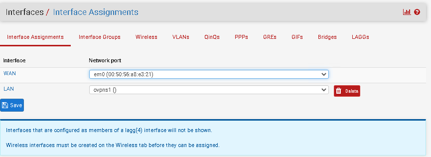
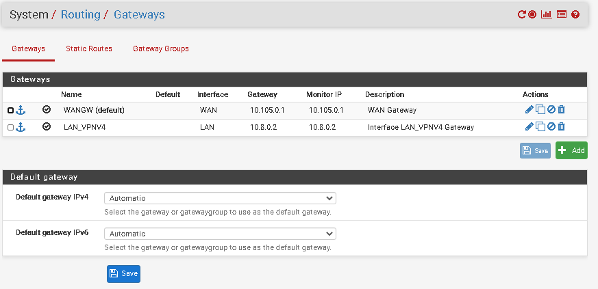
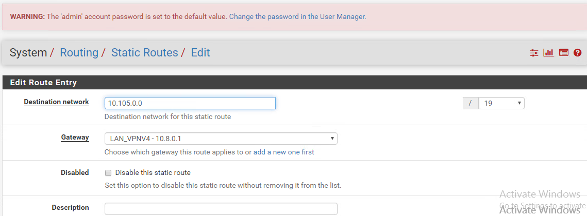
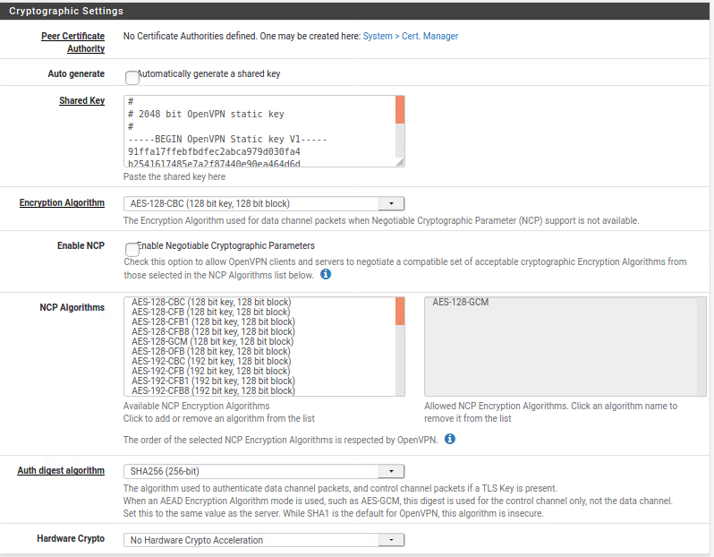
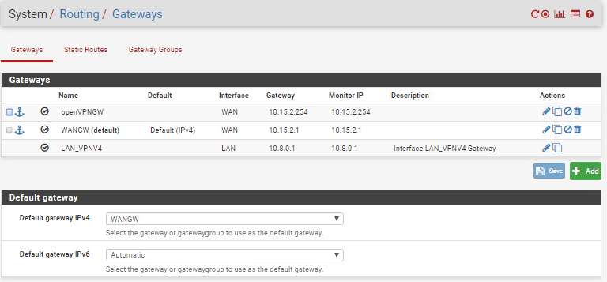

## Introduction

There are certain limitations in the VMware Cloud on AWS such as VPNs configured terminating on T0. Hence we do not have a self-service VPN solution with CDS. VMware recommends openVPN as an alternate solution. 

This document describes the steps to establish VPN connectivity between premises and the VMware Cloud Director using openVPN on PFSense firewalls running on LAN of premises and cloud end.

## Premises Network Planning (Server)

In this example, the premises side openVPN server would be running on PFSense (2.4.4-RELEASE) on the private network 10.105.0.0/19. Port TCP/1194 and TCP/443 would be used for openVPN server.

### Port Forwarding to PFSense

Since clients would be connecting to the public IP, we have forwarded TCP traffic coming to the premises firewall to the port TCP/1194 and TCP/443 to PFSense running on 10.105.0.0/19 network.

In this example we have SonicWall as the firewall. Steps for other firewalls would be different.

 

Where,

*   Public-Outbound-IP is the public IP of premises firewall
*   OpenVPN_Server_pfsense is the LAN IP of premises PFsense. Should be deplayed on WAN facing network (Uplink_WAN_Network).
*   OpenVPN_tcp_port is the set to 1194 for TCP

### OpenVPN Server Configuration

You need to install fresh PFSense on the premises side before you go ahead. You can assign static or DHCP IP to the PFSense WAN interface and access through GUI.

To configure openVPN server on PFsense click on “VPN” -> “OpenVPN” -> “Servers”

Important fields and their values:

*   Server mode : Peer to Peer(Shared key)
*   Protocol : TCP on ipv4 only
*   Device mode : tun-Layer 3 Tunnel Mode
*   Interface : WAN
*   Local port : 1194
*   Description : “OpenVPN server”
*   Shared Key : You can create a new key and keep a copy of it. We would need a key at the client side.
*   Encryption algorithm :  Select the encryption algorithm.
*   In this example we have unchecked  “Enable NCP”
*   Auth digest algorithm : SHA256(256 bit)
*   Leave the rest of the thing default.

Please refer following screenshot for more details:

### Tunnel Settings

On the same server configuration page, scroll down to the Tunnel Setting section

Where,

*   IPv4 Tunnel networks is 10.8.0.0/24, Private network used by pfsense.
*   IPv4 Remote network (10.15.2.0/24) is the client compute network.

Private communication can happen using private IP addresses. In this case we used 10.8.0.0/24 subnet and Server pfsense can pick the 1st usable IP from that subnet and the 2nd usable IP can be automatically assigned to the client pfsense.

Note : This subnet should not conflict with On-premise and on-cloud networks. 

### Interface Assignment

We assign WAN interface while configuring PFsense after installation, also make sure LAN interface is assigned to the ovpnc1 which  gets created after client configuration is done. Please make sure that the LAN interface is in enabled mode.

### Server Firewall Rules

In this example we have allowed traffic for all services on WAN and OpenVPN interface, but if you want to specify the ports or services please follow the [service-port-level-requirement-for-hdm](http://docs.primaryio.com/hdm%20documentation/vcs/network%20planning/ipsec%20tunnel#service-port-level-requirement-for-hdm) section.

WAN interface firewall rules

OpenVPN firewall rules

### Static Route on OpenVPN Client 

We need to set a static route so that traffic for the required network can be routed through the otherside tunnel gateway which is 10.8.0.2 in this case. Default gateways for WAN and LAN interface

Static route to route a traffic to tunnel gateway for remote subnet.

Where,

*   10.15.2.0/24 is client side LAN network, 
*   10.8.0.2 is the gateway of the tunnel interface.

## vCD Network Planning(Client)

### Configure Public access on CDS

In the Tenant portal, customers will need to create the NAT and FW rules to allow OUTBOUND internet access for Virtual Machines.

As a tenant customer will have to modify OVDC Gateway Services in Cloud Director:

*   SNAT rule to allow traffic to flow out to the internet
*   DNAT rule to allow Web Traffic to a virtual machines 	 		

*   External IP is PrimaryIP of the edge gateway
*   Internal IPs are subnets of Routed Org VDC network to which the access should be allowed.

The access can be controlled via the firewall rules. Like in the following example all ports and services are open for the routes network:

### OpenVPN Client configuration

You need to install fresh PFSense on the premises side before you go ahead. You can assign static or DHCP IP to the PFSense WAN interface and access through GUI. PFSense server should be deployed on UPLINK_WAN_NETWORK created during Org. VDC configuration.

To configure openVPN Client on PFsense click on “VPN” -> “OpenVPN” -> “Client” ->”clients”

Where,

Server host or address is a public IP address on the premises side.

Scroll down to Cryptographic section

Where,

*   Share key is same as used on server side,
*   Encryption algorithm None or same as server side,
*   Auth digest algorithm is SHA256(256-bit).

### Tunnel Settings

On the same server configuration page, scroll down to the Tunnel Setting section

Where,

*   IPv4 Tunnel networks is 10.8.0.0/24,
*   IPv4 Remote network (10.105.0.0/19) is the server private network.

### Interface Assignment

We assign WAN interface while configuring PFsense after installation, also make sure LAN interface is assigned to the ovpnc1 network port which  gets created after client configuration is done. 

Please make sure that the LAN interface is in enabled state,  to enable it click on “Interfaces” -> Interface name and tick “Enable” as shown below.

### Client Firewall Rules

In this example we have allowed traffic for all services on WAN and OpenVPN interface, but if you want to specify the ports or services please follow the [service-port-level-requirement-for-hdm](http://docs.primaryio.com/hdm%20documentation/vcs/network%20planning/ipsec%20tunnel#service-port-level-requirement-for-hdm) section.

WAN interface firewall rules

OpenVPN firewall rules

### Static Route on OpenVPN Client

We need to set a static route so that traffic for the required network can be routed through the tunnel gateway which is 10.8.0.1 in this case.

Defined gateways for LAN and WAN Interface,

Static route to route a traffic to tunnel gateway for remote subnet.

Where,

*   10.105.0.0/19 is server side LAN network, 
*   10.8.0.1 is the gateway of the tunnel interface.

## Troubleshooting Tips

*   If you make any changes in OpenVPN settings either on server or client, you need to restart the OpenVPN services.

    Click on “services” -> “OpenVPN” -> Click on the blue restart icon at left bottom.

*   Make sure that the test vm default gateway points to IP address of  the PFsense.
*   Make sure that the Pfsense have a WAN Interface default gateway.
*   If PFsense Web GUI is not reachable, try one or all of the following:
    *   Close and reopen browser
    *   Try to change the browser
    *   Reboot the PFsense virtual machine.
*   PFsense may block ICMP traffic even if ICMP traffic is enabled in firewall rules. 
*   Test the connectivity by doing ssh to the remote system.
