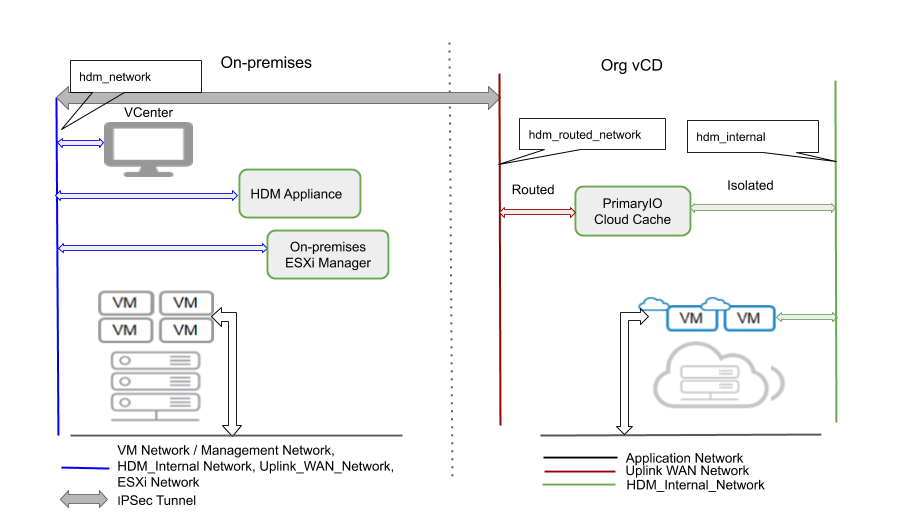

This single network planning is intended to help you rapidly deploy PrimaryIO HDM to a test environment. The steps are intended for a single on-premises network environment, with cloud access via a WAN link and no separation of the management and VM network. All IP assignments in this guide are static/static-pool and connectivity between the on-premises and cloud environments is via IPSec. 

HDM provides a flexible deployment model to cater to a wide range of user needs, including different use cases, performance requirements, scalability, and levels of security. The HDM 2.1.3 Install Guide contains full details of every deployment mode. For simplicity, this document describes an HDM deployment using the **_Standalone, Ultra-Lite_** option. This option supports all the key features of HDM and can also be used for cold migration and validation purposes. 


Network configuration information is required at key points throughout the deployment process. So, develop a network connectivity plan prior to deploying HDM. This section will help guide you through that process. The information captured in this section will be employed later in the installation process. If an IPSec tunnel and cloud configuration have not yet been established, these must be done before moving any further. 

Once connectivity and cloud configuration are complete, be sure to record all applicable details in the tables at the end of this section for easy reference later in the deployment process. 

The following is required to complete the network plan: 


1. Network requirements during OVF deployment
1. Network requirements during on-premises deployment
1. Network requirements during cloud deployment

```
Choose or Create an appropriate network:

A simple network configuration where all connectivity to the cloud is available through one network (e.g., hdm_network). Here hdm_network should have access to the following:
* On-premises vCenter 
* Cloud vCenter via WAN link
* On-premises ESXi
* Cloud ESXi
* HDM Appliance

The required connectivity is highlighted in figure 1. For all steps in the deployment that require a VMware network as input, provide the identified or created hdm_network. It will also be necessary to create two networks in the cloud, hdm_routed_network and hdm_internal.

Failure to create, choose, or configure the networks correctly will cause the installation to fail.
```
Figure 1: Network Configuration of the Test Environment



The remainder of this document will assume you have created a network topology like the one shown in Figure 1, and will refer to the networks by those names. In this configuration, all access has been made possible using single VM network, _hdm_network_.

You will need to provision 

*   20 static IPs on Premise network
*   At least 50 static-pool IPs on Cloud network

These will be required throughout the installation process.

```
NOTE: 
Despite the fact that you will be mapping to a single network, separate IP ranges will need to be provided for each network type.
The subnet range 172.17.0.0/16 is not available for the deployment; it is used internally by HDM microservices.
Please add the vCenter FQDN for the on-premises and cloud vCenters on the on-premises and cloud DNS servers.
```

# Network Configuration forms for Single-Network

Before continuing with the rest of this Quick Start Guide, be sure to print and complete these forms. This will help you identify the correct networks to configure and identify all networking details.

## Network requirements during OVF deployment

*   Provision four IPs on _hdm_network_
*   Use this during OVF deployment

|Network|IP|Netmask|Gateway|
|:-|:-|:-|:-|
|VM Network (Management Network)|Single IP| | |
|HDM_Internal_Network|Single IP| | |
|Uplink_WAN_Network|Single IP| | |
|ESXi_Network|Single IP| | |

Common settings for the OVF deployment:

|Setting Name|Setting Value|
|:-|:-|
|Default gateway network|This should be the single configured network on-premises which in this document is “hdm_network”|
|NTP Server                      |                                                                                                                                                                |
|Network DNS                   |                                                                                                                                                                |
|Default gateway               |Provide default gateway for the “hdm_network”                                                                                    |
|Network DNS Search Path|                                                                                                                                                                |

## Network requirements during on-premises deployment

Common settings for the gateway, subnet, DNS etc., which will be common across the on-premises networks.

|Setting Name|Setting Value|
|:-|:-|
|Subnet mask|255.255.0.0|
|Gateway|192.168.10.1|
|Domain|domain.lan|
|DNS|192.168.5.20, 192.168.5.21</em> 
|NTP|92.168.5.22|

**HDM_Internal_Network**

Provision six IPs on _hdm_network_. complete the table below for reference throughout deployment.

| |Example|Fill value here|
|:-|:-|:-|
| |IP range|192.168.10.100-192.168.10.120, 192.168.10.130 (2 IPs required from “hdm_network” )|

**Uplink_WAN_Network**
| |Example|Fill value here|
|:-|:-|:-|
| |IP range|192.168.10.100-192.168.10.120, 192.168.10.130(2 IPs required from “hdm_network”)|


**ESXi_Network**

| |Example|Fill value here|
|:-|:-|:-|
| |IP range|192.168.10.100-192.168.10.120, 192.168.10.130 (2 IPs required from “hdm_network”)|

## Network requirements during cloud deployment

The following cloud credentials are required to deploy to the cloud.

|vCloud Director FQDN|xyzpqr25.vmware-solutions.cloud.ibm.com|Organization name|Username|Password|
| | | | |

Similar to the previous two deployment stages, provision IPs and identify the correct networks to satisfy the chosen connectivity requirements. The networks to be configured are _HDM Internal network_ and _WAN network configuration** **_from the cloud _hdm_wan_network**. **_Only the IP Range is different between the two networks; all other parameters remain the same.

**HDM Internal network** 
|:-|:-|:-|
| |Example|Fill value here|
| |IP range|192.168.10.100-192.168.10.120, 192.168.10.130|(20 IPs from HDM “hdm_internal)|
| |Subnet mask||255.255.0.0|
| |Gateway|192.168.10.1|
| |Domain|domain.lan|
| |DNS|192.168.5.20, 192.168.5.21|
| |NTP|192.168.5.22|
      
**WAN network configuration**

|:-|:-|:-|
| |Example|Fill value here|
| |IP range|192.168.10.100-192.168.10.120, 192.168.10.130 (30 IPs from “hdm_wan_network”)|
| |Subnet mask|255.255.0.0|
| |Gateway|192.168.10.1|
| |Domain|domain.lan|
| |DNS|192.168.5.20, 192.168.5.21|
| |NTP|192.168.5.22|
