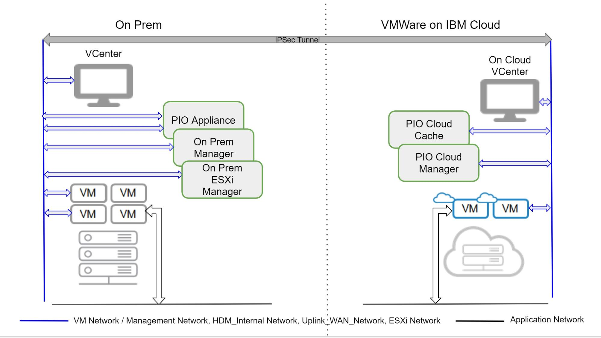
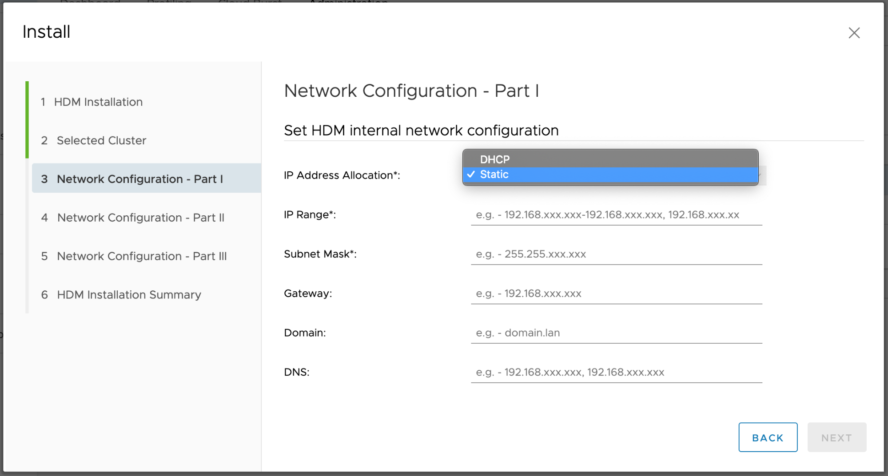
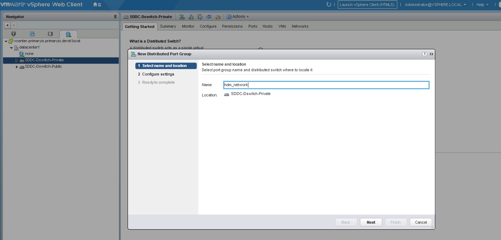
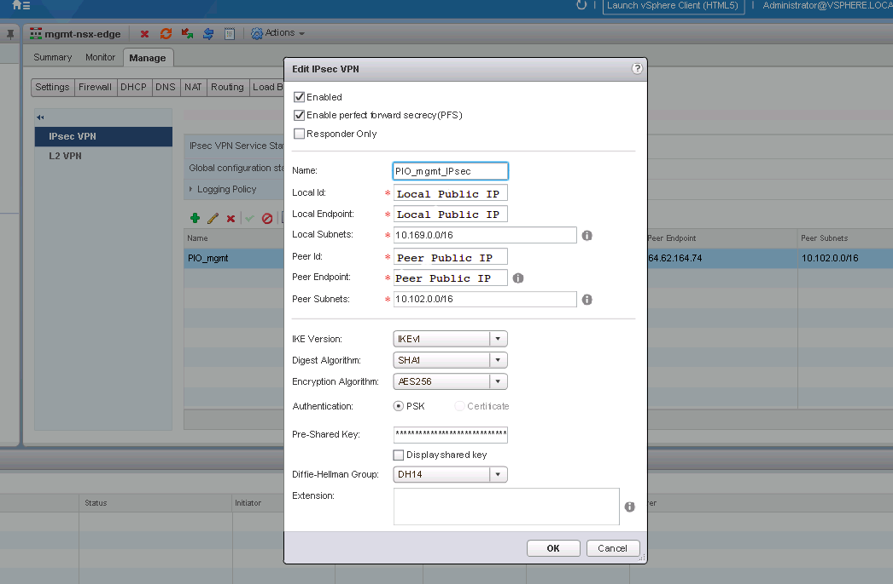
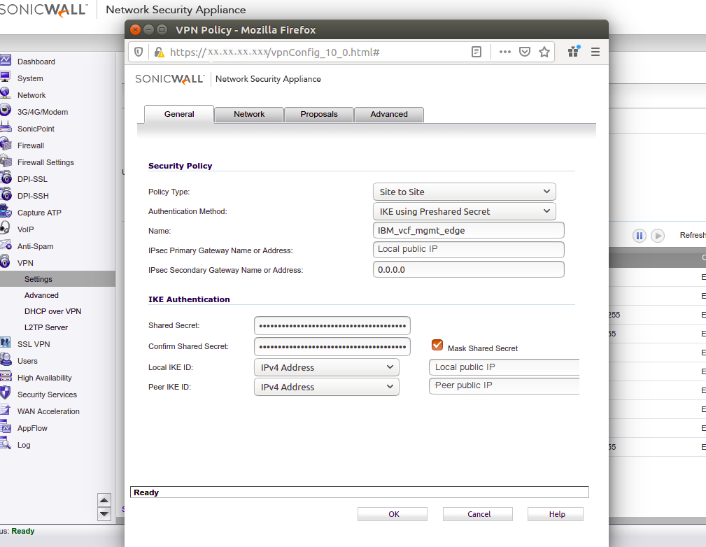
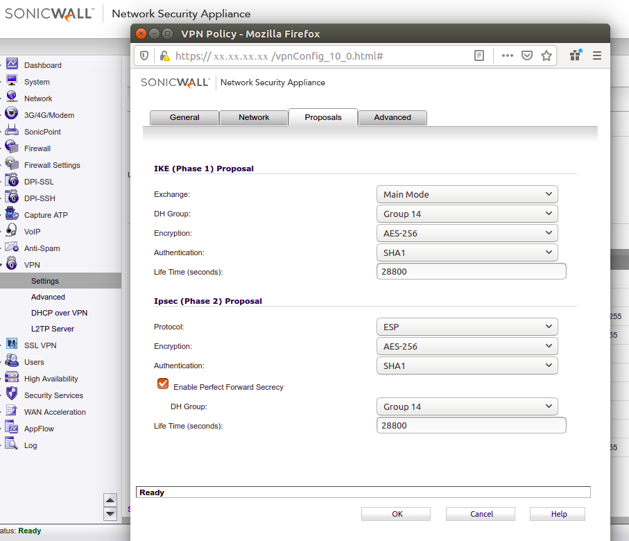
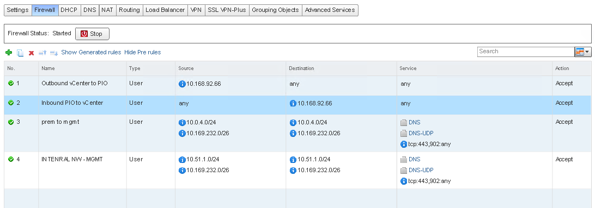

<!-- Copy and paste the converted output. -->


# **HDM 2.1.3 for VMware**


# **Network Configuration - Planning**

 	                        


# Introduction

This document describes the networking aspects of HDM. The HDM 2.1.3 Install Guide has the details of various types of network topologies that are supported. This document details the deployment and configuration of HDM for test purposes with a single network having Static IP. 

This document also covers the preparatory steps with respect to networking that users must perform prior to deploying HDM. 


# HDM Network Support

HDM provides the following flexibility for the network configuration:
1. Choice of networks HDM components should use
2. Choice of IP allocation type for HDM components (Static IP or DHCP)

**Network Types**

An ideal network configuration provides for isolation between types of network traffic, for maximum security, performance and access control. HDM assumes there could be following types of networks in the environment: 


1. Management Network (VM Network) : This usually maps to the VM network and provides access to vCenter. All management API communication with vCenter happens over this network.
2. ESXi Network (ESXi_Network): This usually maps to the VM network and provides access to ESXi.
3. HDM Internal Network (HDM_Internal_Network) : This network is used by HDM for communication among its components. It is recommended to have a dedicated low latency network be configured for this purpose. Depicted in image below as PIO OnPrem Network on On-Premise and PIO Cloud Network on On-Cloud.
4. WAN Network (Uplink_WAN_Network) - This network provides access to the cloud. All data transfer to and from premise to cloud happens over this network. This could be a public link or direct connection between On-Premise and On-Cloud.
5. Application Network : This network is used for data transfer by the Application VMs and each application can be accessed on its own network. So, a large number of application networks are possible. 

While HDM deployment has the flexibility of supporting separation of network traffic as mentioned in the previous section, for test purposes, HDM can also be deployed in environments where there may not be separation between all the types of networks mentioned above. In such situations, the network configuration would be as shown below : 





In this case, all of the 4 networks would map to **_VM Network / Management Network. _**Users would still need to provide details for each of the networks separately. Users can divide the IP subnet into multiple ranges which can be mapped to these four networks. 

For example, for a network 10.102.0.0/16, we can have following IP ranges and can be used accordingly:


*   10.102.1.2 - 10.102.1.20 (VM Network)
*   10.102.1.21 - 10.102.1.40 (ESXi_Network)
*   10.102.1.41 - 10.102.1.60 (Uplink_WAN_Network)
*   10.102.1.61 - 10.102.1.80 (HDM_Internal_Networking)

During HDM deployment, users are required to categorise and map the networks discovered in the vCenter as per the types mentioned above. 


In this case all of the “Source Networks” would map to **_VM Network / Management Network_** during the deployment process as shown below. 


### HDM Network Configuration - Planning

Please fill the table below for use during installation later. 


<table>
  <tr>
   <td><strong>Network</strong>
   </td>
   <td>IP 
   </td>
   <td>Netmask
   </td>
   <td>Gateway
   </td>
  </tr>
  <tr>
   <td>VM Network (Management Network)
   </td>
   <td>
   </td>
   <td>
   </td>
   <td>
   </td>
  </tr>
  <tr>
   <td>HDM_Internal_Network
   </td>
   <td>
   </td>
   <td>
   </td>
   <td>
   </td>
  </tr>
  <tr>
   <td>Uplink_WAN_Network
   </td>
   <td>
   </td>
   <td>
   </td>
   <td>
   </td>
  </tr>
  <tr>
   <td>ESXi_Network
   </td>
   <td>
   </td>
   <td>
   </td>
   <td>
   </td>
  </tr>
</table>


#### Network requirements during on-premise deployment

During the premise deployment phase of the installation we will configure the following networks on prem.


1. HDM_Internal_Network
2. Uplink_WAN_Network
3. ESXi_Network

These are the same as the ones described in previous section on OVF Deployment. During the premise deployment however you need to provide a range or list of IPs for each of these networks.





For all the 3 categories of network, choose the IP allocation mechanism : static IP.

For static IP, following details are required for configuration.


*   IP range : IP list that are free to be allocated for use.
*   Subnet mask : subnet of the IP range
*   Gateway : gateway IP of the network
*   Domain : domain name of the network
*   DNS : to translate the domain name to IP
*   NTP : for time sync

A pool of IP addresses need to be allocated. The number of IPs for each category are

**HDM_Internal_Network: **2 IPs required

**Uplink_WAN_Network: ** 2 IPs required

**ESXi_Network: **2 IPs required


    **Note:  **


1. **The subnet range 172.17.0.0/16 is not available for the deployment; it is internally used by HDM microservices.**

Please fill the table below for reference during the installation process.

**HDM_Internal_Network**


<table>
  <tr>
   <td>
   </td>
   <td><strong>Example</strong>
   </td>
   <td><strong>Fill value here</strong>
   </td>
  </tr>
  <tr>
   <td><strong>IP range</strong>
   </td>
   <td><em>10.102.10.100-10.102.10.120,  10.102.10.130</em>
   </td>
   <td>
   </td>
  </tr>
  <tr>
   <td><strong>Subnet mask</strong>
   </td>
   <td><em>255.255.0.0</em>
   </td>
   <td>
   </td>
  </tr>
  <tr>
   <td><strong>Gateway</strong>
   </td>
   <td><em>10.102.10.1</em>
   </td>
   <td>
   </td>
  </tr>
  <tr>
   <td><strong>Domain</strong>
   </td>
   <td><em>domain.lan</em>
   </td>
   <td>
   </td>
  </tr>
  <tr>
   <td><strong>DNS</strong>
   </td>
   <td><em>10.102.5.20, 10.102.5.21</em> 
   </td>
   <td>
   </td>
  </tr>
  <tr>
   <td><strong>NTP</strong>
   </td>
   <td><em>10.102.5.22</em>
   </td>
   <td>
   </td>
  </tr>
</table>


**Uplink_WAN_Network**


<table>
  <tr>
   <td>
   </td>
   <td><strong>Example</strong>
   </td>
   <td><strong>Fill value here</strong>
   </td>
  </tr>
  <tr>
   <td><strong>IP range</strong>
   </td>
   <td><em>10.102.10.131-10.102.10.151</em>
   </td>
   <td>
   </td>
  </tr>
  <tr>
   <td><strong>Subnet mask</strong>
   </td>
   <td><em>255.255.0.0</em>
   </td>
   <td>
   </td>
  </tr>
  <tr>
   <td><strong>Gateway</strong>
   </td>
   <td><em>10.102.10.1</em>
   </td>
   <td>
   </td>
  </tr>
  <tr>
   <td><strong>Domain</strong>
   </td>
   <td><em>domain.lan</em>
   </td>
   <td>
   </td>
  </tr>
  <tr>
   <td><strong>DNS</strong>
   </td>
   <td><em>10.102.5.20, 10.102.5.21</em> 
   </td>
   <td>
   </td>
  </tr>
  <tr>
   <td><strong>NTP</strong>
   </td>
   <td><em>10.102.5.22</em>
   </td>
   <td>
   </td>
  </tr>
</table>


**ESXi_Network**


<table>
  <tr>
   <td>
   </td>
   <td><strong>Example</strong>
   </td>
   <td><strong>Fill value here</strong>
   </td>
  </tr>
  <tr>
   <td><strong>IP range</strong>
   </td>
   <td><em>10.102.10.152-10.102.10.172</em>
   </td>
   <td>
   </td>
  </tr>
  <tr>
   <td><strong>Subnet mask</strong>
   </td>
   <td><em>255.255.0.0</em>
   </td>
   <td>
   </td>
  </tr>
  <tr>
   <td><strong>Gateway</strong>
   </td>
   <td><em>10.102.10.1</em>
   </td>
   <td>
   </td>
  </tr>
  <tr>
   <td><strong>Domain</strong>
   </td>
   <td><em>domain.lan</em>
   </td>
   <td>
   </td>
  </tr>
  <tr>
   <td><strong>DNS</strong>
   </td>
   <td><em>10.102.5.20, 10.102.5.21</em> 
   </td>
   <td>
   </td>
  </tr>
  <tr>
   <td><strong>NTP</strong>
   </td>
   <td><em>10.102.5.22</em>
   </td>
   <td>
   </td>
  </tr>
</table>


#### Network requirement during on-cloud deployment

Similar to the previous two deployment stages we need to provision IPs and identify the correct networks that satisfy the connectivity requirements. The networks that need to be configured are.

**HDM Internal network: **20 IP pool. Will also be used for VMs during migration

**WAN network configuration: **2 IPs.

Please fill the table below for reference during the installation process.

**HDM_Internal_Network**


<table>
  <tr>
   <td>
   </td>
   <td><strong>Example</strong>
   </td>
   <td><strong>Fill value here</strong>
   </td>
  </tr>
  <tr>
   <td><strong>IP range</strong>
   </td>
   <td><em>10.50.10.100-10.50.10.120</em>
   </td>
   <td>
   </td>
  </tr>
  <tr>
   <td><strong>Subnet mask</strong>
   </td>
   <td><em>255.255.0.0</em>
   </td>
   <td>
   </td>
  </tr>
  <tr>
   <td><strong>Gateway</strong>
   </td>
   <td><em>10.50.10.1</em>
   </td>
   <td>
   </td>
  </tr>
  <tr>
   <td><strong>Domain</strong>
   </td>
   <td><em>domain.lan</em>
   </td>
   <td>
   </td>
  </tr>
  <tr>
   <td><strong>DNS</strong>
   </td>
   <td><em>10.50.5.20, 10.50.5.21</em> 
   </td>
   <td>
   </td>
  </tr>
  <tr>
   <td><strong>NTP</strong>
   </td>
   <td><em>10.50.5.22</em>
   </td>
   <td>
   </td>
  </tr>
</table>


**Uplink_WAN_Network**


<table>
  <tr>
   <td>
   </td>
   <td><strong>Example</strong>
   </td>
   <td><strong>Fill value here</strong>
   </td>
  </tr>
  <tr>
   <td><strong>IP range</strong>
   </td>
   <td><em>10.50.10.121,10.50.10.122,  10.50.10.123</em>
   </td>
   <td>
   </td>
  </tr>
  <tr>
   <td><strong>Subnet mask</strong>
   </td>
   <td><em>255.255.0.0</em>
   </td>
   <td>
   </td>
  </tr>
  <tr>
   <td><strong>Gateway</strong>
   </td>
   <td><em>10.50.10.1</em>
   </td>
   <td>
   </td>
  </tr>
  <tr>
   <td><strong>Domain</strong>
   </td>
   <td><em>domain.lan</em>
   </td>
   <td>
   </td>
  </tr>
  <tr>
   <td><strong>DNS</strong>
   </td>
   <td><em>10.102.5.20, 10.102.5.21</em> 
   </td>
   <td>
   </td>
  </tr>
  <tr>
   <td><strong>NTP</strong>
   </td>
   <td><em>10.102.5.22</em>
   </td>
   <td>
   </td>
  </tr>
</table>


#### WAN Routing Configuration

The following WAN routes are required to access on-cloud from on-premise and vice-versa.


*   **On-Prem WAN route**

    The route which would be set on HDM appliance on premise. The routes will enable communication from on-premise to HDM appliances on-cloud.

    *   **On-Cloud WAN subnet : **Subnet of cloud WAN network on which HDM appliances are deployed
    *   **On-Premise WAN gateway : **On premise WAN gateway which allows access to on-cloud WAN subnet
*   **On-Prem WAN route**

    The route which would be set on HDM appliance on cloud. The routes will enable communication from on-cloud to HDM appliances on-premise.

    *   **On-Premise WAN subnet : **Subnet of premise WAN network on which HDM appliances are deployed
    *   **On-Cloud WAN gateway : **On cloud WAN gateway which allows access to on-premise WAN subnet

<table>
  <tr>
   <td>
   </td>
   <td>
<strong>Example</strong>
   </td>
   <td><strong>Fill value here</strong>
   </td>
  </tr>
  <tr>
   <td><strong>On-Cloud WAN subnet</strong>
   </td>
   <td><em>10.50.0.0/16</em>
   </td>
   <td>
   </td>
  </tr>
  <tr>
   <td><strong>On-Premise WAN gateway</strong>
   </td>
   <td><em>10.102.10.1</em>
   </td>
   <td>
   </td>
  </tr>
  <tr>
   <td><strong>On-Premise WAN subnet</strong>
   </td>
   <td><em>10.102.0.0/16</em>
   </td>
   <td>
   </td>
  </tr>
  <tr>
   <td><strong>On-Cloud WAN gateway</strong>
   </td>
   <td><em>10.50.10.1</em>
   </td>
   <td>
   </td>
  </tr>
</table>


Again, HDM appliances on cloud will need to access Cloud vCenter and ESXi. If routes are requires, note the Network and the gateway which will allow access

**Cloud vCenter Route:**


<table>
  <tr>
   <td>
   </td>
   <td><strong>Example</strong>
   </td>
   <td><strong>Fill value here</strong>
   </td>
  </tr>
  <tr>
   <td><strong>Route through</strong>
   </td>
   <td><em>10.50.10.1</em>
   </td>
   <td>
   </td>
  </tr>
  <tr>
   <td><strong>Network Type</strong>
   </td>
   <td><em>HDM Internal Network</em>
   </td>
   <td>
   </td>
  </tr>
</table>


**ESXi Route:**


<table>
  <tr>
   <td>
   </td>
   <td><strong>Example</strong>
   </td>
   <td><strong>Fill value here</strong>
   </td>
  </tr>
  <tr>
   <td><strong>Subnet</strong>
   </td>
   <td><em>192.163.0.0/16</em>
   </td>
   <td>
   </td>
  </tr>
  <tr>
   <td><strong>Route through</strong>
   </td>
   <td><em>10.50.10.1</em>
   </td>
   <td>
   </td>
  </tr>
  <tr>
   <td><strong>Network Type</strong>
   </td>
   <td><em>HDM Internal Network</em>
   </td>
   <td>
   </td>
  </tr>
</table>


# IPSec tunnel configuration

This network configuration section is for configuring a virtual private network (IPsec) between premise and cloud infrastructure prior to the deployment of the HDM product. This section assumes that cloud infrastructure and vCenter are on the different subnets than the on-premise infrastructure. The examples given in this document are for the configuration of IPsec tunnel between Edge gateway on NSX-V and premise SonicWall firewall. 


## Planning and preparation - Single Network


### Prerequisites checks

Please ensure that following prerequisites are met before proceeding for deployment,


1. Cloud ESXi hosts, Cloud Vcenter and Cloud WAN network should be reachable from the appliance through VPN and FQDN is resolved. 
2. Virtual machines created on the Cloud side WAN network should be able to reach Cloud vCenter and Cloud ESXi and FQDN is resolved. 
3. The cloud DNS is also reachable from the on-premise through the IPsec tunnel. (Please make note that the Cloud side DNS details are required at the time of deployment of HDM product).

In order to meet above requirements, following route based IPsec VPN  tunnels need to be configure. For additional information please refer to VMware document [Configure a VPN Connection Between Your SDDC and On-Premises Data Center](https://docs.vmware.com/en/VMware-Cloud-on-AWS/services/com.vmware.vmc-aws.networking-security/GUID-92F6C09E-8E74-430E-8F79-C2E5B2150ADA.html)


1. **Premise WAN network to SDDC Compute Edge Gateway** -  This will allow communication to Cloud VC and cloud WAN network. Please add vCenter and WAN network in the same IPsec tunnel
2. **Premise WAN network to SDDC Management Edge Gateway** - This will allow communication to Cloud  ESXi through private IPs. 
3. **IPsec tunnel between  Compute and Management Edge gateways** - When NSX-V is used as a software defined network on cloud, the IPsec tunnel needs to be configured between  Compute and Management Edge gateways.  This is required for cloud HDM components to reach cloud ESXi hosts.  For more information please refer to the Blog [Can a VM in the VMC Compute Network access the SDDC Management Network](https://cloud.vmware.com/community/2019/05/06/can-vm-vmc-compute-network-access-sddc-management-network/)


### Creating Private Network on Cloud side

Here is the process to create the  network for HDM which will act as a WAN and INTERNAL network.


*   On cloud Vcenter Click on Networking -> SDDC-DSwitch-Private (Right Click)-> Distributed Port Group -> New Distributed Port Group. In this wizard, enter the network name and click on next. 



*   Follow the next section of setting port group properties. In this section, configure the setting as per your requirements


*   Click on Finish.
*    Define static and DHCP IP ranges on Edge Gateway -> Manage -> DHCP -> click on “+” -> Enter the start IP, End IP, DNS and Default Gateway and save it.


*   Please make sure Interface is in connected state


*   Please make sure the interface is connected to all required edges.


*   


## Setting up Single Network IPsec tunnel 

This section describes the steps to setup a single network IPsec tunnel. Once all the prerequisites are met and planning is done, please follow the steps below.

**Premise WAN network to SDDC Compute Edge Gateway**

This section describes the steps to setup a single network IPsec tunnel. Once all the prerequisites are met and planning is done, please follow the steps below.


```
Note: The recommendation is to have following Firewall configuration for all on-premise and on-cloud endpoints
```


Here are the Firewall configuration on premise and at the cloud side. 


*   At the Source - source subnet.
*   At the Destination - Destination subnet
*   Service - **Any**


 if you want to allow specific traffic from source to destination, please refer (&lt;Reference to Admin guide>)


1. Information required and the steps to be covered at the cloud side,
    1. Collect following information before you start with IPsec configuration:
        1. Local ID(cloud public IP)
        2. Local subnet(s)(cloud subnets)
        3. Peer ID(premise public IP)
        4. Peer subnet(s)(Premise subnets)
    2. Log on to the cloud vCenter.
    3. Click on “Home” -> “Network and Security” -> “NSX Edges” -> “Click on the edge”
    4. On edge - Click on “Manage” -> “VPN” -> “IPsec”


    5. Click on the “+” sign to add IPsec tunnel and fill up the required information.





    6.  Click on the Ok and start IPsec service.
2. Information required and the steps to be covered at the Premise Side,

    In this example we have used the SonicWall firewall. The sections may not be the same for other firewalls, but overall flow would  be the same.

    7. Fill up the general setting as shown below 

     


```
Note: Instructions below are specific to SonicWall and users are requested to do the equivalent for their specific firewall.
```





3. Proposal settings should be similar to the cloud side. 




4. Now start the IPsec tunnel services  and check the newly configured IPSec tunnel is up.

Once the configuration is done, to test the connectivity, try to ping/access cloud side VMs from the premise. If the test is not successful, it may be required to correctly add DNS to resolve FQDN.


Here are additional considerations, 


*   If management and compute networks are connected to the same edge gateway then you can specify multiple subnets under a single IPsec tunnel.
*   Once all the IPsec tunnels are up, please check if required port are opened of different end points as mentioned in this document (Link to port requirement doc).

**Premise WAN network to SDDC Management Edge Gateway**

Steps for this section are the same as **Premise WAN network to SDDC Compute Edge Gateway **except local/remote endpoints and subnets.

 **IPsec tunnel between  Compute and Management Edge gateways**

**	**In this section, users are supposed to configure IPsec tunnel between cloud  Compute amd Management gateway so that HDM components attached to hdm_internal network can communicate to ESXi hosts. For more details please refer to [this^](https://cloud.vmware.com/community/2019/05/06/can-vm-vmc-compute-network-access-sddc-management-network/) link.


## Setting up Multiple Network IPSec tunnel

This section describes the steps to setup a multiple network IPsec tunnel. Once all the prerequisites are met and planning is done, please follow the steps below.


```
Note: The recommendation is to have following Firewall configuration for all on-premise and on-cloud endpoints
```


Here are the Firewall configuration on premise and at the cloud side. 


*   At the Source - source subnet.
*   At the Destination - Destination subnet
*   Service - **Any**


 if you want to allow specific traffic from source to destination, please refer (&lt;HDM 2.1.3 for VMware Admin Guide - VCS>)


## Firewall Rules

Below section covers setting in details to allow traffic going from source to destination. These settings should be done on all endpoints.  In case of a single network config, hdm_internal and hdm_wan network would be the same.


### Service/Port level requirement for HDM


1. **Premise wan network - Cloud wan network ports(Inbound/Outbound): **22, 2379, 32820, 2376, 6000-6050, 7000-7050, 8000-8050,  443
2. **Premise  wan network - tenant portal ( Inbound/Outbound): 443**
3. **~~Premise wan network to cloud management network(Cloud ESXi,~~ Cloud DNS Inbound/Outbound)): **902, 443, 53(UDP, UDP-DNS)
4. ~~Cloud compute edge gateway - cloud management **(Inbound/Outbound)**:~~ 
    1. **~~INTENRAL_NW - Cloud VC: 443. 902 ~~**
    2. **I~~NTENRAL_NW - Cloud ESXi: 443, 902, 53(UDP, UDP-DNS)~~**

### 
     Single Network firewall rules example


    Example of firewall rules in Compute Edge or Customer Edge and Management Edge gateway is given below,

    *   10.50.1.0/24  is cloud WAN network
    *   10.102.0.0/16 is the premise WAN network. On premise ESXi, vCenter, Appliance and DNS have access to this subnet.
    *   10.168.92.66 is vCenter
    *   10.169.232.0/26 is cloud ESXi and cloud DNS network.

  Compute Edge or Customer Edge


  Management Edge


### 
    Multiple Networks firewall rules example


    Example of firewall rules in Compute Edge or Customer Edge and Management Edge gateway is given below,


    *   10.50.1.0/24  is cloud WAN network i.e. hdm_wan_network
    *   10.51.1.0/24  is cloud INTERNAL network i.e. hdm_inernal_network
    *   10.0.4.1/24 is the premise of the WAN network. On premise ESXi, vCenter, Appliance and DNS have access to this subnet.
    *   10.168.92.66 is vCenter
    *   10.169.232.0/26 is cloud ESXi and cloud DNS network.

     


    Compute Edge rules:


    Management Edge firewall rules:

  

<p id="gdcalert19" ><span style="color: red; font-weight: bold">>>>>>  gd2md-html alert: inline image link here (to images/image19.png). Store image on your image server and adjust path/filename/extension if necessary. </span><br>(<a href="#">Back to top</a>)(<a href="#gdcalert20">Next alert</a>)<br><span style="color: red; font-weight: bold">>>>>> </span></p>




