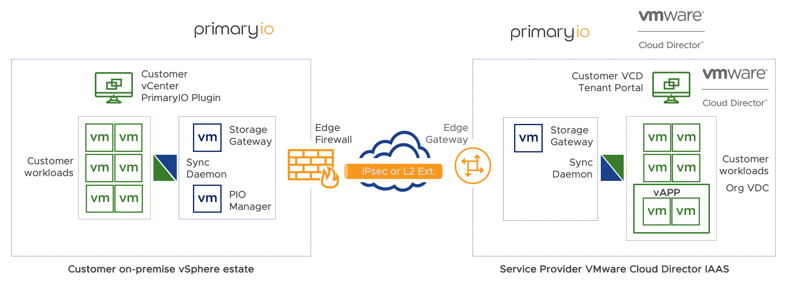

---
title: Introduction
---
<!---
This file is generated by a macro preprocessor.
Dont edit this file directly but make changes in 
to the source document in macros/ 
-->

## What is Hybrid Cloud Data Management (HDM)

PrimaryIO’s HDM provides solutions to perform migrations of VMware based virtual machines from on-premises to VMware based cloud environments.  HDM’s warm migration is a unique technology that decouples VM compute and storage to flexibly move workloads to and from the cloud rapidly and lets you fully control the data.  By combining the integrated smart IO analyzer and our optimized transfer technologies, we can ensure you can start using the cloud immediately instead of waiting days or weeks.

## How Does Hybrid Cloud Data Management (HDM) Work?
HDM decouples compute (Virtual Machines - VM) and storage (Virtual Disks - VMDK) functions to quickly and efficiently move workloads to VMware-based cloud providers by identifying the frequently used data (hot dataset) and initially only moving the minimum amount of that data to the cloud. This enables VMs to be migrated and turned up in the cloud provider in the shortest possible timeframe.  

_Figure 1: HDM Architecture_

## Why Hybrid Cloud Data Management (HDM)?

1. **Rapid VM migration:** HDM allows for VMs to be powered up in the target cloud environment using only the hot data.  The cold data is efficiently transferred as a background process.
1. **Trial Migrations:** Migrations can be complicated and may take several maintenance windows before they are successful.  HDM’s flexible approach allows for VMs to be rapidly powered up in the target cloud and reverted to the on-premise environment if needed. 

The HDM product binaries can be used on
* VMware Cloud Director
* VMware Cloud Director service
* VMware on AWS

## HDM Migrations

HDM 2.2 is used to migrate VMs from on-premises environments to the cloud. There are two main use cases for HDM migrations:

1. **Agile Rapid Migration (ARM):** The capability to decouple compute from data, to minimize downtime during migration.
2. **Try Before Commit (TBC):** The capability to quickly test the VMs running in the cloud before fully committing to the cloud.

## Use Cases

### Agile Rapid Migration (ARM)

This use case permanently moves the VM and all of its data to the cloud. Two types of this migration are possible:

|Version|vCenter|VMware Cloud Director services|VMware Cloud Director|
|-------|-------|-------|-------|---------|
|v2.1|Warm/Cold|Cold|Cold|
|v2.2|Warm/Cold|Warm/Cold|Warm/Cold|

*   **Cold migration**: Application data is moved to the cloud using **bulk migration**. The VM is powered off throughout the migration and becomes available in the cloud once the data has been fully transferred. 
*   **Warm migration**: A subset of data, called the working set, is moved to the cloud and the VM is instantly available. HDM’s cloud cache is used for optimal IO performance. Any cache misses are fetched from the on-premises environment via the WAN. The remainder of the data set is either moved online through HDM, or offline in the background. Once all data has been moved to the cloud, it is reconciled with the data from the running application to minimize application downtime.

The choice of which migration type to employ depends on the amount of data in the VM and if the VM needs to be instantly available during the migration, or if prolonged downtime can be tolerated.

### Try Before Commit (TBC)

This use case provides a quick way to migrate VMs to the cloud while retaining the data on-premises. This helps users validate how the applications would run in the cloud, to help them decide whether or not to fully migrate them. The user can choose to migrate the applications back to the on-premises environment at any time.

## HDM Deployment for VMware Cloud Director & Cloud Director service

1. **PrimaryIO Plug-in:** Installed and registered on VMware vCenter for HDM management.
2. **PrimaryIO Manager:** The main controlling appliance that controls and orchestrates the entire system.
3. **PrimaryIO Filter:** A **VMware VAIO filter framework** to gather I/O traces from each VM.
4. **PrimaryIO Analyzer:** The I/O Analyzer (IOA) aggregates I/O traces from all VMs and analyzes the I/O traces at a block level to make recommendations on the cloud cache requirements.
5. **On-premises Storage Gateway:** Provides access across the WAN link to deliver traffic optimization and redundancy against failures. It also accesses and manages the on-premises VMDKs for cloud-based VMs.
6. **Cloud Storage Gateway:** Provides access across the WAN link to enable cloud-based VMs read/write access back to the on-premises environment. It is possible to have multiple gateways for redundancy.
7. **Cloud Cache:** The cloud cache is a fast, reliable, persistent cache for the VMs in the cloud. The cache maintains the working set of VMs, enabling them to run efficiently without moving entire data sets into the cloud. When there is a cache miss, the storage gateway obtains blocks from the on-premises VMDK.
8. **Sync Daemon:** Located in both environments to deliver compression, encryption, and de-duplication for data being transferred from on-premises to cloud environments. It also provides a mechanism to pause and resume data transfers in the event of a WAN disconnect.

_Figure 2: Location of HDM 2.2 components_

## HDM Deployment for VMware Cloud on AWS

1. **PrimaryIO Plug-in:** Installed and registered on VMware vCenter for HDM management.
2. **PrimaryIO Manager:** The main controlling appliance that controls and orchestrates the entire system.
3. **PrimaryIO Filter:** A **VMware VAIO filter framework** to gather I/O traces from each VM.
4. **PrimaryIO Analyzer:** The I/O Analyzer (IOA) aggregates I/O traces from all VMs and analyzes the I/O traces at a block level to make recommendations on the cloud cache requirements.
5. **On-premises Storage Gateway:** Provides access across the WAN link to deliver traffic optimization and redundancy against failures. It also accesses and manages the on-premises VMDKs for cloud-based VMs.
6. **Cloud Storage Gateway:** Provides access across the WAN link to enable cloud-based VMs read/write access back to the on-premises environment. It is possible to have multiple gateways for redundancy.
7. **Cloud Cache:** The cloud cache is a fast, reliable, persistent cache for the VMs in the cloud. The cache maintains the working set of VMs, enabling them to run efficiently without moving entire data sets into the cloud. When there is a cache miss, the storage gateway obtains blocks from the on-premises VMDK.
8. **Sync Daemon:** Located in both environments to deliver compression, encryption, and de-duplication for data being transferred from on-premises to cloud environments. It also provides a mechanism to pause and resume data transfers in the event of a WAN disconnect.

_Figure 3: HDM components_

 
 # Modifications performed into the Guest VM OS :
 HDM performs few checks and operations into the guest VM operating system during the ‘Prepare To Migrate’ step. This is a mandatory step and performed before migrating a VM to the cloud. It is applicable to any type of cloud deployment (VMware Cloud Director, Cloud Director service or  VMware Cloud on AWS )
 
 Below operations are performed on each Guest VM that is planned for migration :
 
 **On supported Linux guest VM :**
1.	Checks if VMware tools are installed and running
2.	HDM Appliance copies a prepare to migrate tool  in Guest User’s home directory->.PIO->hyc
3.	Installs iSCSI initiator package if it is not installed
4.	Adds iSCSI driver/module to initrd
5.	Installs grub scripts to support, customized Grub entries and to support EFI
6.	Configures and Updates grub to allow iSCSI booting
7.	Fetches pre-migration network configuration information and then sets it post migration 

**On supported Windows guest VM**
1.	Checks if VMware tools are installed and running
2.	HDM Appliance copies prepare to migrate tool in Guest user’s ProgramData->PIO->hyc directory 
3.	HDM Appliance copies NVSPBIND package in in Guest user’s tmp directory 
4.	Installs  NVSPBIND package if  it is  not installed 
5.	Disables WFP(Windows Filtering Platform) Lightweight Filter driver like ms_wfplwf_upper, ms_ndiscap_lower and ms_ndiscap to unblock iSCSI traffic
6.	Configures ISCSI initiator service by turning on 'msiscsi' service and sets 'service_start_mode' to 'automatic' so that it can be auto started after each boot.
7.	Schedules a task which makes offline devices online.
8.	Fetches pre-migration network configuration information and then sets it post migration 

> **To know in detail about HDM component interactions refer the  [Appendix](http://ec2-34-222-41-154.us-west-2.compute.amazonaws.com/hdm%20doc%202.2/appendix#hdm-component-interactions) section of this document.**

 
# HDM Deployment

HDM provides a flexible deployment model to support a wide range of user needs regarding use case, performance, scalability, and security. The detailed steps and options for each deployment method are covered in the **Deployment planning** and subsequent sections. 

### Deployment Overview of HDM
[plugin:youtube](https://youtu.be/i39XhQUZI6A)

