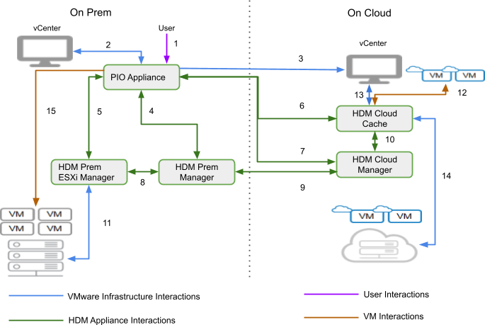

# Prepare to migrate

 Below operations are performed on each Guest VM that is planned for migration :
 
 **On supported Linux guest VM :**
1.	Checks if VMware tools are installed and running
2.	HDM Appliance copies a prepare to migrate tool  in Guest User’s home directory->.PIO->hyc
3.	Installs iSCSI initiator package if it is not installed
4.	Adds iSCSI driver/module to initrd
5.	Installs grub scripts to support, customized Grub entries and to support EFI
6.	Configures and Updates grub to allow iSCSI booting
7.	Fetches pre-migration network configuration information and then sets it post migration 

**On supported Windows guest VM**
1.	Checks if VMware tools are installed and running
2.	HDM Appliance copies prepare to migrate tool in Guest user’s ProgramData->PIO->hyc directory 
3.	HDM Appliance copies NVSPBIND package in in Guest user’s tmp directory 
4.	Installs  NVSPBIND package if  it is  not installed 
5.	Disables WFP(Windows Filtering Platform) Lightweight Filter driver like ms_wfplwf_upper, ms_ndiscap_lower and ms_ndiscap to unblock iSCSI traffic
6.	Configures ISCSI initiator service by turning on 'msiscsi' service and sets 'service_start_mode' to 'automatic' so that it can be auto started after each boot.
7.	Schedules a task which makes offline devices online.
8.	Fetches pre-migration network configuration information and then sets it post migration

# HDM - Component Interactions

<!---
The source document with the details is here
https://docs.google.com/document/d/1NE57ykCOyp7xMLzDA-HLqZYsNmPA1M_ObQCw0gVkPNY/edit 
-->
## Introduction

The document describes the interactions between HDM components and VMware Infrastructure both on premise and on cloud. The document would describe the authentication mechanism, permissions and network connectivity required for these interactions.

1. User interaction with HDM PIO Appliance
    1. Authentication - User credentials
    1. Port - 22 (TCP), 443 (TCP) 
        1. Details
            1. User interactions with the PIO appliance over a web interface over HTTPS. HTTPS is configured with a self signed certificate initially.
            1. SSH for optional PrimaryIO customer support access.
1. HDM PIO Appliance to on-premise vCenter
    1. Authentication - User credentials
    1. Port - 443 (TCP)
        1. Details
            1. PIO Appliance uses vSphere API to interact with vCenter to manage:
            1. Plugin - Requires read and write permissions to register HDM vCenter plugin. HDM plugin provides interfaces to configure, monitor, manage and migrate virtual machines.
            1. Catalog - Requires read and write permission to Create catalog, Upload OVF,  Delete Catalog Item and Delete Catalog. HDM uploads OVF which are then required to deploy HDM appliances during the initial configuration.
            1. Virtual machine - Requires read and write permission to deploy/ create virtual machines, manage virtual machines and delete virtual machines. These permissions are required during HDM appliance deployment and virtual machine migration.
            1. ESXi - Requires permission to install VMware certified VAIO filter.
            1. Storage Policy Based Management - Required read and write permission to create, modify and delete storage policies.
1. HDM PIO Appliance to on-cloud vCenter
    1. Authentication - User credentials
    1. Port - 443 (TCP)
    1. Details
        1. PIO Appliance uses vSphere API to interact with vCenter to manage:
            1. Catalog - Requires read and write permission to Create catalog, Upload OVF,  Delete Catalog Item and Delete Catalog. HDM uploads OVF which are then required to deploy HDM appliances during the initial configuration.
            1. Virtual machine - Requires read and write permission to deploy/ create virtual machines, manage virtual machines and delete virtual machines. These permissions are required during HDM appliance deployment and virtual machine migration.
1. HDM PIO Appliance to HDM Prem Manager
    1. Authentication - User credentials
    1. Authorization - SSL certificate
    1. Ports - 22 (TCP), 443 (TCP), 2376 (TCP), 8000-8010 (TCP), 32820 (TCP)
    1. Details
        1. PIO Appliance uses port 2376 to deploy and manage HDM services containerized within HDM Prem Manager
        1. SSH access is required for initial configuration.
        1. Service level interaction between HDM services is over HTTPS authorized using SSL certificates.
        1. IO Analyzer summaries created in ESXi are pushed to PIO Appliance using port 32820
        1. 8000-8010 used for internal service configuration authorized using SSL certificates.
1. HDM PIO Appliance to HDM Prem ESXi Manager
    1. Authentication - User credentials
    1. Authorization - SSL certificate
    1. Ports - 22 (TCP), 443 (TCP), 2376 (TCP), 8000-8010 (TCP)
    1. Details
        1. PIO Appliance uses port 2376 to deploy and manage HDM services containerized within HDM Prem ESXi Manager
        1. SSH access is required for initial configuration.
        1. Service level interaction between HDM services is over HTTPS authorized using SSL certificates.
        1. 8000-8010 used for internal service configuration authorized using SSL certificates.
1. HDM PIO Appliance to HDM Cloud Cache
    1. Authentication - User credentials
    1. Authorization - SSL certificate
    1. Ports - 22 (TCP), 443 (TCP), 2376 (TCP), 8000-8010 (TCP)
    1. Details
        1. PIO Appliance uses port 2376 to deploy and manage HDM services containerized within HDM Cloud Cache
        1. SSH access is required for initial configuration.
        1. Service level interaction between HDM services is over HTTPS authorized using SSL certificates.
        1. 8000-8010 used for internal service configuration authorized using SSL certificates.
1. HDM PIO Appliance to HDM Cloud Manager
    1. Authentication - User credentials
    1. Authorization - SSL certificate
    1. Ports - 22 (TCP), 443 (TCP), 2376 (TCP), 8000-8010 (TCP)
    1. Details
        1. PIO Appliance uses port 2376 to deploy and manage HDM services containerized within HDM Cloud Manager
        1. SSH access is required for initial configuration.
        1. Service level interaction between HDM services is over HTTPS authorized using SSL certificates.
        1. 8000-8010 used for internal service configuration.
1. HDM Prem ESXi Manager to HDM Prem Manager
    1. Authentication - User credentials
    1. Authorization - SSL certificate
    1. Ports - 5000-5010 (TCP), 12000-12010 (TCP)
    1. Details
        1. 5000-5010, 12000-12010 are used for Internal data transfer.
1. HDM Prem Manager to HDM Cloud Manager (**Across Site to Site Network Interconnect**)
    1. Authentication - User credentials
    1. Authorization - SSL certificate
    1. Ports - 22 (TCP), 443 (TCP), 6000-6010 (TCP), 7000-7010 (TCP)
    1. Details
        1. Data transfer between the HDM prem manager and HDM cloud manager happens over port 600x and 700x. The data is compressed and encrypted before being transferred across the “interconnect”.
        1. SSH access is required for initial configuration.
        1. Service level communication across HDM components is over HTTPS using the SSL certificates.
1. HDM Cloud Manager and HDM Cloud Cache
    1. Authentication - User credentials
    1. Authorization - SSL certificate
    1. Port - 32820 (TCP), 5000-5010 (TCP), 12000-12010 (TCP)
    1. Details
        1. IO Analyzer summaries created on HDM cloud cache are pushed to HDM Cloud Manager over port 32820.
        1. 5000-5010, 12000-12010 are used for Internal data transfer.
1. HDM Prem ESXi Manager and on-premise ESXi
    1. Authentication - User credentials
    1. Authorization - VMware Authorization
    1. Port - 902 (TCP), 32821 (TCP), 32822 (TCP)
    1. Details
        1. Read and Write of data from and to VMDK is managed by HDM Prem ESXi Manager is done on port 32821 and 32822. 
        1. Port 902 is required for Network File Copy (NFC)
1. HDM Cloud Cache to Virtual machines running on cloud over cache
    1. Authentication - User credentials 
    1. Authorization - Data Encrypted
    1. Ports - 3260 (TCP), 9001 (TCP), 9002 (TCP)
    1. Details - 
        1. Virtual machines running over cache on cloud boots over iSCSI port 3260.
        1. 9001, 9002 is used for data Transfer using MicroVM.
1. HDM Cloud Cache to Cloud vCenter 
    1. Authentication - vCenter User Credentials
    1. Authorization - VMware Authentication
    1. Ports - 443 (TCP)
    1. Details
        1. HDM cloud cache requires access to on cloud vCenter at port 443 to authenticate access to ESXi at port 443 and 902 to write data to the VMDK.
1. HDM Cloud Cache to VMDK/ Disks on Cloud
    1. Authentication - vCenter User Credentials
    1. Authorization - VMware Authentication
    1. Ports - 443 (TCP), 902 (TCP)
    1. Details
        1. HDM cloud cache requires access to on cloud vCenter at port 443 to authenticate access to ESXi at port 443 and 902 to write data to the VMDK.
1. PIO Appliance to Virtual machines on premise
    1. Authentication - Sudo/ Admin user credentials
    1. Authorization - User credentials
    1. Port - 443 (TCP)
    1. Details
        1. Virtual machines that need to be migrated to the cloud using warm migration will need to be prepared on premise.
        1. PIO Appliance uses VMware Guest Tool to insert scripts to check and configure the following:
            1. Check VMware tool versions
            1. Check OS version
            1. Check iSCSI initiator configuration. If not installed, installs iSCSI initiator and configures VM boot over iSCSI on cloud

# Guest OS support Matrix

<!--- https://docs.google.com/spreadsheets/d/1TRXV1A0BI4nr8gtKSHzYZJDX2vDz3QkisCWG6Az1zQY/edit#gid=0
converted using 
https://tabletomarkdown.com/convert-spreadsheet-to-markdown/ -->

| OS                              | Boot Mode | VCD WARM      | VCS WARM      | Any Cold      |
| ------------------------------- | --------- | ------------- | ------------- | ------------- |
| Windows Server 2012 R2 (64 bit) | MBR       | Qualified     | Qualified     | Qualified     |
| Windows Server 2012 R2 (64 bit) | UEFI      | Not Supported | Not Supported | Qualified     |
| Windows Server 2016 (64 bit)    | MBR       | Qualified     | Qualified     | Qualified     |
| Windows Server 2016 (64 bit)    | UEFI      | Not Supported | Not Supported | Qualified     |
| Windows Server 2019 (64 bit)    | MBR       | Qualified     | Qualified     | Qualified     |
| Windows Server 2019 (64 bit)    | UEFI      | Not Supported | Not Supported | Qualified     |
| Windows 2008 R2                 | MBR       | Qualified     | Qualified     | Qualified     |
| Windows 2008 R2                 | UEFI      | Not Supported | Not Supported | Not qualified |
| RHEL 6.9                        | MBR       | Not Supported | Not qualified | Qualified     |
| RHEL 6.9                        | UEFI      | Not qualified | Not qualified | Not qualified |
| RHEL 6.10                       | MBR       | Qualified     | Not qualified | Qualified     |
| RHEL 6.10                       | UEFI      | Not qualified | Not qualified | Not qualified |
| RHEL 7.2                        | MBR       | Qualified     | Qualified     | Qualified     |
| RHEL 7.2                        | UEFI      | Qualified     | Not qualified | Qualified     |
| RHEL 7.3                        | MBR       | Qualified     | Qualified     | Qualified     |
| RHEL 7.3                        | UEFI      | Qualified     | Qualified     | Qualified     |
| RHEL 7.4                        | MBR       | Qualified     | Qualified     | Qualified     |
| RHEL 7.4                        | UEFI      | Qualified     | Qualified     | Qualified     |
| RHEL 7.5                        | MBR       | Qualified     | Qualified     | Qualified     |
| RHEL 7.5                        | UEFI      | Qualified     | Not qualified | Qualified     |
| RHEL 7.6                        | MBR       | Qualified     | Qualified     | Qualified     |
| RHEL 7.6                        | UEFI      | Qualified     | Not qualified | Qualified     |
| RHEL 8.2                        | MBR       | Qualified     | Qualified     | Qualified     |
| RHEL 8.2                        | UEFI      | Qualified     | Qualified     | Qualified     |
| RHEL 8.3                        | MBR       | Qualified     | Qualified     | Qualified     |
| RHEL 8.3                        | UEFI      | Qualified     | Qualified     | Qualified     |
| SLES 12-SP5                     | MBR       | Qualified     | Qualified     | Qualified     |
| SLES 12-SP5                     | UEFI      | Qualified     | Not qualified | Qualified     |
| SLES 15-SP2                     | MBR       | Not qualified | Not qualified | Qualified     |
| SLES 15-SP2                     | UEFI      | Qualified     | Not qualified | Qualified     |
| CentOS 7.6(1810)                | MBR       | Qualified     | Qualified     | Qualified     |
| CentOS 7.6(1810)                | UEFI      | Qualified     | Qualified     | Qualified     |
| CentOS 7.5(1804)                | MBR       | Qualified     | Qualified     | Qualified     |
| CentOS 7.5(1804)                | UEFI      | Not qualified | Not qualified | Qualified     |
| CentOS 7.4(1708)                | MBR       | Qualified     | Qualified     | Qualified     |
| CentOS 7.4(1708)                | UEFI      | Not qualified | Not qualified | Qualified     |
| CentOS 8.2                      | MBR       | Qualified     | Qualified     | Qualified     |
| CentOS 8.2                      | UEFI      | Qualified     | Qualified     | Qualified     |
| CentOS 8.3                      | MBR       | Qualified     | Qualified     | Qualified     |
| CentOS 8.3                      | UEFI      | Qualified     | Qualified     | Qualified     |
| Ubuntu Server 16.04             | MBR       | Qualified     | Qualified     | Qualified     |
| Ubuntu Server 16.04             | UEFI      | Not Supported | Not Supported | Qualified     |
| Ubuntu Server 18.04             | MBR       | Qualified     | Qualified     | Qualified     |
| Ubuntu Server 18.04             | UEFI      | Qualified     | Qualified     | Qualified     |
| Ubuntu Server 20.04             | MBR       | Qualified     | Qualified     | Qualified     |
| Ubuntu Server 20.04             | UEFI      | Qualified     | Qualified     | Qualified     |

Legend:

**Qualified** : Tested and qualified by PrimaryIO.

**Not Qualified** : Supported but pending qualification by PrimaryIO.

**Not Supported** : Does not work for given migration mode.