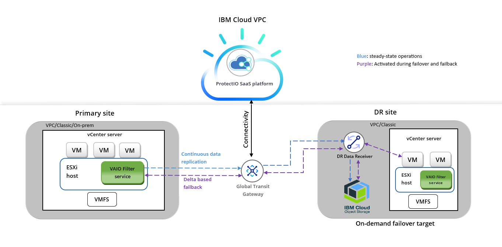

**Chapter 1: Service Overview:**

**What is ProtectIO Solution?**

ProtectIO is PrimaryIO’s on-demand disaster recovery as a service
(“DRaaS”) platform.

ProtectIO is delivered as a web-accessible, multi-tenant, IBM
Cloud-native Software-as-a-Service and helps customers by providing a
robust disaster recovery solution while leveraging the latest cloud
economics for an attractive Total Cost of Ownership.

ProtectIO is a powerful disaster recovery solution for VMware
application workloads.

You can use ProtectIO to protect VMware virtual machines (VMs) by
replicating them to the cloud and recovering them, as needed, to a
target.

ProtectIO has a Ransomware Recovery option, RecoverIO, that utilises
immutable cloud object storage buckets to enable an organisation to
recover to a pre-ransomware/data corruption point-in-time.

The ProtectIO application development was unencumbered by legacy
investment into backup and snapshot approaches to business continuity.
In contrast, ProtectIO is at the forefront of what cloud infrastructure
now makes possible. ProtectIO is a true, cloud-native, SaaS architected,
on-demand disaster recovery as a service (“DRaaS”) platform. Leveraging
such features as cloud object storage and rapid bare metal on-demand
provisioning, ProtectIO has the unique ability to deliver the lowest
cost DR solution in standby/protect mode, while giving the highest
“on-prem” performance when in failover active mode.

Services:

For more details, please see the ProtectIO Solution Brief

**Intended Audience**

This information is intended for anyone who wants to protect their
virtual machines running on vCenter with the ProtectIO DRaaS Platform.

1.  **Architecture:**

> **Service Components**
>
> ProtectIO consists of following components:
>
> **ProtectIO DRaaS platform:**
>
> ProtectIO is a Cloud-Native SaaS platform that enables tenant admins
> to perform operations like creating CDP (continuous data protection)
> policies, initiating failover/failback as well as monitoring overall
> status.
>
> **DR Receiver:**
>
> For enabling replication for disaster recovery, the DR receiver is
> deployed on the target site and the PrimaryIO Replication filter is
> installed on ESXi hosts on the primary site.
>
> Receiver is a service that receives blocks from the primary site and
> store on target object storage.
>
> **VAIO replication filter:**
>
> It is a library that is installed on each ESXi host on a primary site
> where VMs to be protected are present. The IO filter is responsible
> for actual replication of data from primary site to target site.
>
> DR Receiver and VAIO filter are deployed separately for each tenant.
>
> **The Architecture**
>
> ProtectIO provides a business continuity (BC) and disaster recovery
> (DR) solution in a VMware virtual environment, enabling the
> replication of critical virtual machines as quickly as possible, with
> minimal data loss. ProtectIO enables a virtual-aware recovery with low
> values for both the RTO and RPO.
>
> 
>
> **How recovery works with ProtectIO**
>
> As a part of customer onboarding, ProtectIO super admin user will
> install a receiver on cloud/target site and IO filter on primary site.
> Tenant admin can use the CDP configuration to specify which virtual
> machines that need to be protected/replicated. Once virtual machines
> are added in the CDP configuration, protectIO will start the initial
> sync process and send all blocks to object storage. Changed blocks are
> copied by IO filter and sent to the target site, while the write
> continues to be processed on protected site. On the target site, these
> blocks are received by the receiver and written to object storage.
> During failover, rehydration process starts, and virtual machines are
> created on target site and then blocks from object storage are written
> to the target virtual machines.

2.  Benefits of using ProtectIO

> **Primary Site Agnostic**
>
> ProtectIO is a solution for protecting and recovering virtual
> machines. It does not matter which type of primary site customer
> has on-premises or IBM Cloud Classic or VPC.
>
> **Recovery time / Minimal RPO**
>
> When a disaster strikes, the ProtectIO DRaaS solution can failover
> rapidly. With continuous Data Protection technology, ProtectIO enables
> near zero Recovery Point Object (RPO) which ensures minimal data loss.
>
> **Continuous Data Replication**
>
> Continuous replication does not require scheduling, agents, or
> appliances.
>
> **Intuitive**
>
> Intuitive user interface offers centralised management. Customers can
> start using ProtectIO for protecting their VMware based virtual
> infrastructure in a few hours after subscribing.
>
> **No performance impact on primary site**
>
> ProtectIO does not need any agents to be installed on virtual machines
> for protection. Agentless protection technique has no performance
> impact on the production site.
>
> **Cloud ready**
>
> ProtectIO supports IBM Classic and IBM Cloud VPC. Customers can have
> their disaster recovery site on any of these options.
>
> **One-Click failover**
>
> Tenant admin can start failover of protected VMs in case of disaster
> with just one click. No additional steps are required to start a
> failover.

**Updated hypervisor based replication**

**Team managed Pre-DR analysis to understand the divisions of a
businesses VM’s and data.**

**Instantaneous updates for any new feature**

**Secure authentication and authorization to ensure no human errors or
invalid users**

**IBM cloud integration and access to up and coming ICCR integration**

**Allows multiple tenants**

**VM functionality protection and ability to make multiple protection
policies**

**Site/CDP recovery level - file level done by backups**

**Ability to test DR solution at any time via fire drills**

**Detailed and immediate failover reports**
